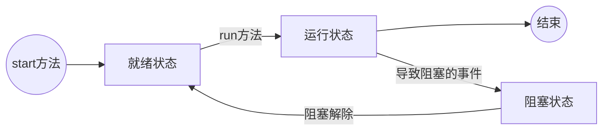

[TOC]


# 版权声明

- Java 系列读书笔记来源于 Cay S. Horstmann 所著《Java 核心技术 卷I 基础知识（第10版）》[1]；
- 该系列笔记不以盈利为目的，仅用于个人学习、课后复习及科学研究；
- 如有侵权，请与本人联系（hqpan@foxmail.com），经核实后即刻删除；


# 1. Java 简介

- Java：
  - Java ME：嵌入式开发；
  - Java SE：提供底层支持，桌面程序开发；
  - Java EE：企业平台、互联网平台搭建；
- 相关概念：
  - JDK：Java Development Kit；kit, n.[C] 工具箱，工具包； 
  - JRE：Java Runtime Environment；
- Java 的优点：
  - 可移植性；
  - 面向对象；
  - 是为数不多支持多线程开发的语言；
  - 使用引用代替指针；
  - 方便的内存回收处理机制；
  - 高效的网络处理能力；
- 高级程序语言：
  - 编译型；
  - 解释型；
  - 注意：Java 兼具两种特点，先将源文件编译成与平台无关的字节码文件（.class），后由 JVM 将字节码解释成机器码指令；
- 三类操作系统：
  - windows；
  - UNIX；
  - 类UNIX：Linux，MAC OS；
- JavaDoc 文档：
  - 带有 deprecated 字样描述的方法不宜使用；
  - deprecate, vt. 反对，不赞成；


# 2 Java 编译和运行

- 类名与文件名：
  - `public class`中，类名需与文件名一致；
  - `class`中，类名可与文件名不一致；
- `classpath`：
  - `classpath`默认设置为当前目录；
  - `set classpath=.`：表示将`classpath`设置为当前目录；
  - JVM 通过`classpath`设置的路径加载类；
- ==面试题==`path`和`classpath`的区别：
  - `path`：操作系统提供的路径配置，定义所有可执行程序的路径；
  - `classpath`：由 JRE 提供的，用于定义 Java 程序解释时的类加载路径；


# 3. Java的基本程序设计结构

- `args`：arguments；
- `console`：n. 控制台，仪表板；
- `src`：source，源码目录；

## 3.1 简单的Java应用程序

- 在命令行窗口运行程序：
  - `javac filename.java`：编译器将源码转换成字节码；
  - `java filename`：Java虚拟机执行存放在`filename.class`中的字节码；
    - 虚拟机将从指定类中的`main`方法（或称为函数） 开始执行；
    - 在类的源文件中必须包含一个`main`方法；
      - `main`方法必须为`public`类型；
- Java 区分大小写；
- `public`：访问修饰符（access modifier）；
- 类名以大写字母开头，若由多个单词构成，则采用驼峰命名法；
- 源码文件命名：源代码的文件必须与 `public` 类的名字相同，扩展名为 `.java`；
- 字节码文件：使用 `.class`作为扩展名，与原文件存储在同一个目录下；


## 3.2 注释

- Java支持三种注释形式：
  - 文档注释：`/**...*/`，可自动生成文档；
  - 在Java中不允许`/* ... */`注释嵌套；


## 3.3 数据类型

### 3.3.1 数据类型概述

- Java：一种强类型语言，为每一个变量声明一种类型；

  - 基本数据类型：
    - 整型：byte，short，int， long；
      - 默认值：0；
    - 浮点型：float，double；
      - 默认值：0.0；
    - 布尔型：boolean；
      - 默认值：false；
    - 字符型：char；
      - 默认值：`\u0000`；
  - 引用数据类型：涉及内存关系的使用；
    - 数组、类、接口：默认值为 null；
  - Java 中的整数默认表示成 int，浮点数默认表示为 double；
    - 无后缀的整数默认为 int 类型，如需使用长整型，则应添加后缀`L`，E.g. `10L`；
    - 无后缀的浮点数默认为 double 类型，E.g. `float f = 1.3`将报错，因为1.3默认是 double 类型；
  - 注意：String 不是基本数据类型；
- 各个基本数据类型的大小：
  - 注意：浮点数的表示方法是 IEEE 754，因此 float 和 double 的表示范围分别大于 int 和 long；

|          | 1字节 | 2字节 | 4字节 | 8字节  |
| :------: | :---: | :---: | :---: | :----: |
| 数据类型 | byte  | short |  int  |  long  |
| 数据类型 |       | char  | float | double |

- 选用数据类型的原则：
  - 表示数值：int、double；
  - 数据传输、文字编码转换：byte；
  - 内存或文件的大小、表的主键列：long；
  - 处理中文字符：char；（供参考的原则）


### 3.3.1 整型

- 表示数值：
  - 长整型`long`：后缀`L`或`l`，为避免混淆，应尽量使用大写的`L`；
  - 十六进制：前缀`0x`或`0X`；
  - 八进制：前缀`0`；
    - 八进制表示法容易与数值混淆，尽量少用，E.g. 010；
  - 二进制：前缀`0b`或`0B`；
  - （可选）为数字添加下划线：E.g. `1_000_000`；
    - 增加可读性；
    - 编译器运行时，将去除这些下划线；
- 整型数的最大最小值：
  - Integer.MAX_VALUE；
  - Integer.MIN_VALUE；


### 3.3.2 浮点类型

- 表示数值：
  - float：后缀`F`或`f`
  - （可选）double：后缀`D`或`d`；
  
- 特殊的浮点数：
  
  - 浮点数的最大最小值：
    - Double.MAX_VALUE；
    - Double.MIN_VALUE；
  - 正无穷：
    - Float.POSITIVE_INFINITY；
    - Double.POSITIVE_INFINITY；
  - 负无穷：
    - Float.NEGATIVE_INFINITY；
    - Double.NEGATIVE_INFINITY；
  - NaN：not a number，各个NaN被认为不相同；
    - Float.NaN；
    - Double.NaN；
  - 检测某个值是否等于`Double.NaN`：
    - `if(Double.isNaN(x))`;
      - 正确；
    - `if(x==Double.NaN)`；
      - 错误；
  
  


### 3.3.3 char 类型

- char 类型可保存一个中文字符；
- 常见字符的编码范围：
  - 数字：`0`-`9`，48-57；
  - 大写字母：`A`-`Z`，65-90；
  - 小写字母：`a`-`z`，97-122；
    - 与大写字母相差32；
- 转义序列`\u`可出现在加引号的字符串之外；
  - 其他转义序列仅能出现在加引号的字符串之中；
- Unicode转义序列在解析代码之前得到处理；
  - 因此出现在注释中的转义序列，由于在解析代码之前被替换为字符，可能引发语法错误；


### 3.3.4 Unicode 和 char 类型

- code point（码点）与code unit（代码单元）：

  - 码点：编码表中某个字符对应的代码值；

  - 代码单元：每个字符用16位表示；
    - 常用 Unicode 字符使用一个代码单元表示；
    - 辅助字符使用两个代码单元表示；

- 在 Java 中，char 类型描述 UTF16 编码中的一个代码单元；

- 不建议使用 char 类型；

  - 除非需要处理 UTF16 代码单元；
  - 最好将字符串作为抽象数据类型处理；

- 返回代码单元数量：

```java
str1.length();			// 返回代码单元数量；
str2.codePointCount();	// 返回码点数量；
str3.charAt(n);			// 返回第 n 个代码单元；

// 获取第 i 个码点；
int index = str4.offsetByCodePoints(0, i);
int cp = str4.codePointAt(index);
```

  

### 3.3.5 boolean 类型

- boolean：adj.布尔数学体系的；
- Java 中不支持用0表示 false，用非0值表示 true；


## 3.4 变量

- 不提倡在一行中申明多个变量；

  - E.g. `int i,j`；

  - 逐一声明变量可提高程序可读性；

- 声明一个变量后，必须用赋值语句对变量进行显式初始化；

  - 不能使用未初始化的变量；
  - Java中的声明可置于代码中的任意位置，提倡将声明放在靠近变量第一次使用的地方；

- 常量;

  - `final`：定义常量，不能被覆写的方法，不能被继承的类；
- 常量只能被赋值一次，此后不能修改；
    - 习惯上，常量名中的每个字母均使用大写；
    
- `static final`：定义类常量；
  
  - 类常量定义于`main`方法的外部；
    - 可在一个类的多个方法中使用；
  - 全局常量：被声明为`public static final`，其它类中的方法也可使用该常量，常量名的所有字母均需大写；
  - `final`修饰符大多用于基本域类型和不可变类型；

    - E.g. `String`为不可变类型，未提供修改字符串的方法；

    - 对于可变的类不应使用`final`，令人费解；

      - E.g. 以下错误示例中`final`表示存储在`evaluations`变量中的对象引用，不会再指向其他的`StringBuilder`对象，但该对象可以修改；

```java
private final StringBuilder evaluations;
```

- 代码块：
  - 普通代码块：用`{}`；
  - 构造代码块：每次实例化对象时，都会调用构造代码块中的语句，且先于构造方法被调用；
  - 静态代码块：使用`static`定义的代码块，服务于静态变量初始化；
    - 在非主类中定义的代码块：静态代码块的执行顺序优先于构造代码块和构造方法，且无论实例化多少个对象，静态代码块中的语句也只执行一次；
    - 在主类中定义的代码块：静态代码块中的语句执行顺序优先于Main方法；


## 3.5 运算符

- 除法：
  - 整数除以0，产生异常；
  - 浮点数除以0，结果为无穷大或NaN（not a number）；
- 简化运算符：`%=`；

### 3.5.1 数学函数与常量

- `Math`类中，包含有各种数学函数；
  - `Math.sqrt(x)`：开方；
  - `Math.pow(x, a)`：x 的 a 次幂，两个参数均为 double 类型；
  - `Math.PI`：近似表示 π 的常量；
  - `Math.E`：近似表示 e 的常量；
  - `Math.round()`方法：
  
    - 返回离该值最近的一个整数；
    - 该方法返回的数据类型为 long；
- `floorMod(position+adjustment, 12)`，若除数为负数，取余/求模时余数亦为负数；
- 在源文件顶部加上`import static java.lang.Math.*;`，则不必在数学方法名和常量名前添加前缀`Math`；
- 运行速度与可移植性之间的权衡：
  - `Math`类中所有方法的例程：运行速度快；
  - `StaticMath`类：在各个平台上得到相同的结果；
  - 可移植性：确保同一个浮点数计算，在不同的虚拟机上运行得到相同的结果；


### 3.5.2 数据类型转换

- 数据类型转换：
  - 自动类型转换：表示范围较小的数据类型转换为表示范围较大的数据类型；
  
  - 强制类型转换：表示范围较大的数据类型转换为表示范围较小的数据类型；
    
    - 截断小数部分，存在信息丢失；
    - 注意：Java 对 byte 类型的有特殊处理，若赋给 byte 的常量值在$[-128,127]$之间，则自动将 int 转换为 byte；若赋给其的数值不在该范围内，则需开发者自行使用强制类型转换；
  

```java
byte num1 = 20;		// int 自动转换为 byte
byte num2 = 200;	// 超出 byte表示范围，报错
```


- 自增自减运算符会改变变量的值，因此它们的操作数不能是数值；

- 三目操作符：可嵌套多个三目运算符，但将降低程序可读性；

  ```java
  x<y?x:y
  ```

- 掩码（mask）：指一串二进制数字，通过与目标数字的按位操作，实现屏蔽指定位的功能；

- 逻辑运算符和位运算符：

  - 逻辑运算符：`&&`、`||`、`！`；
  - 位运算符：

    - `&`、`|`不使用短路求值；
    - `^`：位运算符，异或 xor；
    - `～`：非；
    - `>>`：按位右移，高位用符号位填充；
    - `>>>`：按位右移，高位用0填充；
    - `<<`：按位左移，低位用0填充；
      - 不存在`<<<`；
  - ==面试题==逻辑运算符和位运算符的区别：
    - 逻辑运算符支持短路逻辑；
    - 位运算符既可以进行位运算，又可以进行逻辑运算，但不支持短路逻辑；

- 使用位运算符的注意事项：

  - `float`、`double`不能执行移位操作；
  - `byte`、`short`移位前被自动转换为`int`类型，然后执行移位操作；
  - 若左操作数为`int`类型，则先将左操作数对32取模，然后执行移位操作；
    - E.g. `1<<35`等价于`1<<3`；
  - 若左操作数为`long`类型，则先将左操作数对64取模，然后执行移位操作；


## 3.6 字符串

### 3.6.1 定义

- 表示方式：
  - char：单引号；
  - String：双引号，双引号中的内容表示一个`String`类的匿名对象；
- `String`：为不可变类型，字符串的内容不可变，指向字符串的引用可变；


### 3.6.2 实例化

- `String`的实例化方式：

  - 直接赋值：
    - 实现同一个字符串数据的共享操作；
    - 自动将数据保存到字符串对象池中，减少相同数据的产生；
  - 通过`String`类的构造器进行实例化：`String str = new String("Andrew");`；
    - 上述示例中会开辟两块堆内存空间，分别由匿名对象`"Andrew"`和关键字`new`开辟；
    - 由`new`开辟的内存空间的引用，被赋值给`str`，而由匿名对象开辟的内存空间将成为垃圾；
    - 该种实例化方法不会将字符串自动保存到字符串对象池中，而是新开辟一个堆内存空间；

- ==面试题==：`String`类两种实例化方法的区别？

  - 直接赋值：仅产生一个实例化对象，可自动保存到内存池中，以实现对象重用；
  - 构造方法：产生两个实例化对象，且不会自动入池，无法实现对象重用，但是可借助`intern()`方法手动入池；
  - 备注：intern，vt. 拘留，软禁；n.[C] 实习生；

- String 对象（常量）池可分为两种：

  - 静态常量池：`.class`文件加载时自动将其中的字符串、其它常量、类和方法进行分配；
  
  ```java
  String strA = "Hello, world!";
  String strB = "Hello, " + "world!";
  // strA == strB, true;
  ```
  
  - 运行时常量池：`.class`文件加载后，为其中的变量提供的常量池；
    - 程序加载时并不确定以下示例中`temp`中的内容，该引用可被修改；
    - 不宜频繁修改字符串的引用，避免产生大量垃圾空间；
  
  ```java
  String temp = "world!";
  String strA = "Hello, world!";
  String strB = "Hello, " + temp;
  // strA == strB, false;
  ```

- 频繁使用`+`连接字符串产生大量垃圾空间，使用`StringBuilder`类避免该问题；

```Java
StringBuilder builder = new StringBuilder();
builder.append("ch");
builder.append("str");
String completedString = builder.toString();  
// 返回一个与构建器或缓冲器内容相同的字符串；
```

  

### 3.6.3 字符串与数组之间的转换

- 字符串与**字符**数组：
  - 构造器：
    - `String(char[] value)`；
    - `String(char[] value, int offset, int count)`；
      - offset, n.[C] 偏离，偏移量；
  - 将**字符**数组转换为字符串：`public char[] toCharArray()`；
- 字符串与**字节**数组：
  - 转换目的：传输二进制数据、编码转换；
  - 构造器：
    - `String(byte[] bytes)`；
    - `String(byte[] bytes, int offset, int length)`；
  - 将**字节**数组转换为字符串：`public byte[] getBytes()`；
  - 编码转换：`byte[] getBytes(String charsetName)`；


### 3.6.3 子串

- `String`类的`substring(a,b)`方法：
  - 从字符串中提取第 a 至 b-1 个字符，组成新的字符串；
  - 提取出的子串长度为 b-a；
- 查找子串：
  - `boolean contains(CharSequence s)`：查找子串；
  - `int indexOf(String str)`：查找子字符串并返回索引，若无匹配结果，则返回-1；
  - `int indexOf(int ch, int fromIndex)`：从指定位置起，查找子字符串并返回索引，若无匹配结果，则返回-1；
  - `int lastIndexOf(String str)`：**反向**查找子字符串并返回索引，若无匹配结果，则返回-1；
  - `int lastIndexOf(String str, int fromIndex)`：从指定位置起，**反向**查找子字符串并返回索引，若无匹配结果，则返回-1；
  - `boolean startsWith(String prefix)`：是否以指定的字符串开头；
  - `boolean	startsWith(String prefix, int toffset)`：判断从指定位置起，是否以指定的字符串开头；
  - `boolean endsWith(String suffix)`：是否以指定的字符串结尾；


### 3.6.4 替换、拼接、拆分和截取

- 替换：

  - `String	replaceAll(String regex, String replacement)`：替换所有匹配的子串；
  - `String	replaceFirst(String regex, String replacement)`：替换第一个匹配的子串；

- 拼接：

  - `+`：
  - 当一个非字符串值与一个字符串进行拼接时，前者被转换为字符串；
    - 任何一个 Java 对象均可转换为字符串；
- `String concat(String str)`：将该字符串连接到对象字符串的末尾；
  - 静态`join`方法：将多个字符串拼接后，使用界定符分隔；

  ```java
  String all = String.join("/", "S", "M", "L", "XL");
  ```

- 拆分：

  - `String[] split(String regex)`；
  - `String[] split(String regex, int limit)`：指定拆分个数；

- 截取：

  - `String substring(int beginIndex)`；
  - `String substring(int beginIndex, int endIndex)`；
- `trim()`：除去字符串首尾空格；
  
  


### 3.6.5 字符串比较

- 检测字符串的内容是否相同：

  - 备注：case，n. 大小写；

  ```java
  str1.equals(str2);				// 区分大小写；
  str1.equalsIgnoreCase(str2);	// 不区分大小写；
  compareTo (String anotherString)
  compareToIgnoreCase (String anotherString)
  ```

- `str1 == str2`：用于判断字符串在内存中的地址是否相同；

  ```java
  String str1 = "hello";
  String str2 = "hello";
  // java 在缓冲区查找是否存在常量对象“hello”；
  // 若存在该对象，则将该对象地址赋值给 str2；
  
  new String str1 = "hello";
  new String str2 = "hello";
  // 直接在内存中开辟一个存储空间，并将该对象地址赋值给 str2；
  
  // new 操作符返回的是引用；
  ```
  
- ==面试题==：`==`和`equals()`的区别？

  - `==`应用于基本数据类型比较数值，应用于引用数据类型时比较内存地址；
  - `equals()`比较两者的内容；


### 3.6.6 空串与 Null

- 空串与 Null 的区别：

  - `""`：有实例化对象；
  - Null：无实例化对象；

- 判断字符串是否为空串：

  ```java
	if(str.length()==0)			
  if(str.euqals(""))				
  ```
  
- Null 值上不能调用方法，会报错，因此先判断是否为 Null，后判断是否为空串；

  ```java
if(str != null && str.length() != 0)
  ```
  
### 3.6.7 大小写转换

- `toUpperCase()`；
- `toLowerCase()`；


## 3.7 输入输出

### 3.7.1 读取输入

- 若使用的类不在`java.lang`包中，则应使用`import`加载该包；

  - `Scanner`类定义在`java.util`中；

- 构造一个`Scanner`对象，并与标准输入流`System.in`关联；

```java  
Scanner in = new Scanner(System.in);
String name = in.nextLine();		
// nextLine 方法读取一行；
// next 方法读取一个单词；

int age = in.nextInt();				
// nextInt 方法读取一个整数；
// nextDouble 方法读取一个浮点数；
```


### 3.7.2 格式化输出

- `printf()`支持格式化输出，类似于`String.format("...");`；

  - `static String format(String format, Object... args)`；
  - `printf`中的转义字符为`%`；

- 占位符：

  - `%c`：字符；
  - `%s`：字符串；
  - `%d`：整数；

- `\t`：
  - 对字符串：补全当前长度到4的整数倍；
  - 对数字：补全当前长度到8的整数倍；

  


## 3.8 控制流程

### 3.8.1 术语

|      英文       |  中文  | 释义 |
| :-------------: | :----: | :--: |
|      block      |   块   |  -   |
| block statement | 块语句 |  -   |

- Java 不允许在两个嵌套的块中声明同名变量；
- `else`与相距最近的`if`配对；
- 循环结构：`for`、`while`、`do...while`；
- 在`switch`中使用枚举常量时，不必在标签中指明枚举名，可由`switch`的表达式值确定；
- switch 的用法：
  - 仅支持byte、short、int、 char、String、枚举；

```java
switch(value) {
    case constant1 :
        statements;break;
    case constant2:
        statements;break;
    case constant3:
        statements;break;
    default:
        statements;
}
```

- 选择循环语句的原则：
  - for：已知循环次数；
  - while：
    - 循环次数未知，但已知循环终止条件；
    - 在循环结束后仍需使用循环计数变量；


### 3.8.2 中断控制流程语句

- Java 中提供带标签的`continue，break`语句；
  - 跳转至带标签语句块的末尾；
  - 功能类似于`goto`语句；
  - 不提倡使用该语句；

```java
labelSample:
while(condition1)
{
    if(condition2)
        break labelSample;
}
```

## 3.9 大数值

- BigInteger 类  BigDecimal 类：
  - 不能使用`+，-，×，/`进行四则运算；
  - 应使用`add`、`subtract`等方法；


## 3.10 数组

- 声明、创建数组：
  - 数组的长度可为变量；
  - 允许匿名数组和长度为0的数组；
  - `array.length`：获取数组长度；
  - `for each`语句依次处理数组中的所有元素；

```java
int[] a;					// 声明数组（推荐），将类型与变量名分开；
int a[];					// 声明数组；
int[] a = new int[100];		// 创建数组；
Arrays.toString(a)			// 返回结果，E.g.[1,2,3]；
Arrays.deepToString(a)		// 返回二维数组；
return new int[] {1, 2, 3};	// 数组作为返回值；
```


### 3.10.3 数组拷贝

- 数组拷贝时，两个变量引用同一个数组；

  - 如需将一个数组中的值拷贝到新的数组中，则应使用`Array.copyOf()`；
  - `Array.copyOf()`应用与数组本身，通过改变参数，修改数组大小；
- java.lang.System.arraycopy：数组拷贝；

```java
arraycopy(Object src, int srcPos, Object dest, int destPos, int length)
// Copies an array from the specified source array, beginning at the specified position, to the specified position of the destination array.
```

- `String[] args`：字符串数组，即命令行参数；


### 3.10.4 数组排序

```java
Arrays.sort(arrayName);		// 快速排序算法；
Math.random();				// 生成区间为[0,1)的一个随机浮点数；

import java,util.*;
Random()					// 构造一个新的随机数生成器；
int nextInt(int n);			// 返回一个 0-n-1 之间的随机数；
```

### 3.10.5 不规则数组

- 不规则数组：
  - Java 中没有多维数组，用“数组的数组”表示多维数组；
  - E.g. 二维数组中，每行对应的一维数组长度可以不同；

- 简化的初始化方式：

```java
int[][] arrayName = 
{
    {1, 2},
    {3, 4},
};

arrayName.length		// 数组的行数；
arrayName[i].length		// 第i行的项数；
```

  

# 4. 对象与类

## 4.1 面向对象程序设计 OOP

### 4.1.1 术语

- OOA：面向对象分析；
- OOD：面向对象设计，具有3个特征；
  - 封装；
  - 继承；
  - 多态；
- OOP：Object-oriented programming；
- instance：实例，由类构造的对象；
- instance field：实例域，即对象中的数据；
- state：状态，某个对象中实例域的集合；
- 如何区分业务场景中的类和方法：名词作为类，动词作为方法；
- 栈内存和堆内存：
  - 栈内存：保存堆内存的地址；
  - 堆内存：保存对象的具体信息，由`new`开辟堆内存空间；
- 垃圾空间：没有栈内存指向的堆内存，会被GC（Garbage Collector，垃圾收集器）不定期回收；


### 4.1.2 类之间的关系

- uses-a：依赖（dependence），即一个类的方法操纵另一个类的对象；
  - 尽量减少类之间的相互依赖，即让类之间的耦合度最小；
- has-a：聚合（aggregation），类A的对象包含类B的对象；
- is-a：继承（inheritance）;
- UML：unified modeling language，统一建模语言，用于绘制类图；


## 4.2 使用预定义类

### 4.2.1 对象变量

- 构造器（constructor）：一种特殊的方法，用于构造并初始化对象；
  - 构造器的名称与类名相同；
- 对象变量：不包含对象本身，而是一个对“对象”的引用；
  - 可将对象变量设置为 NULL；
  - 若将 method 应用于未初始化的对象上，将产生编译错误；
  - 若将 method 应用于值为 NULL 的对象上，将产生运行时错误（runtime error）；
```java
Date birthday = new Date()；
birthday = NULL;
```


### 4.2.2 LocalDate 类

- UTC：coordinated university time，协调世界时/世界统一时间；
```java
LocalDate.now()			// 构造新对象表示当前日期；
LocalDate.of(2000,1,1)	// 提供年月日构造特定日期的对象；
.getYear()
.getMonthValue()
.getDayOfMonth()
```


### 4.2.3 更改器方法与访问器方法

- 更改器方法与访问器方法：

  - mutator method：更改器方法，修改对象，常命名为`setXXX`，E.g. `setSalary`；
  - accessor method：访问器方法，只访问而不修改对象；
    - 域访问器：只返回实例域值；
    - 常命名为`getXXX`，E.g. `getSalary`；


## 4.3 用户自定义类

### 4.3.1 类

- 一个源文件中仅能有一个公有类，可以有任意数量的非公有类；
  - 源文件名必须与 public 类一致；
  - 优先使用不可变的类；
  - 编译器将为每个类创建对应的类文件`.class`；

    - 不同的类可放置于不同源文件中（推荐），也可放置于同一源文件中；
  - 编译源程序的两种方法：


  ```java
  javac Empolyee*.java			// 使用通配符；
  javac EmployeeTest.java		// 编译含有main函数的文件;
  ```

- 关于实例域的要求：
  - 实例域应设置为 private 类型，以免破坏封装；
  - 不能在任何方法中命名与实例域同名的变量；
    - 以免同名变量在方法内部屏蔽实例域中命名的变量；
- 隐式参数：出现在方法名前面的对象；
  - E.g. `number007.salary`；
  - 关键字`this`可用于表示隐式参数；
- 不要编写返回引用可变对象的访问器方法；==未理解，page110-111==
  - 如需返回一个可变数据域的拷贝，应使用`clone`；
- 匿名对象：即没有引用的对象，E.g. new Stack<>(Integer)，该对象在使用后将被回收；
- 设计要求：
  - 类中应提供无参数构造器；
  - 为保证封装效果，类中不应有输出语句；
  - 提供设置和返回各个实例域的方法，`set...`，`get...`；
  - 应提供一个获取对象详细信息的方法，`getinfo`；


### 4.3.2 构造器

- 构造器与类同名；

- 构造器无返回值，不带任何返回参数类型，不能写作`void`；
  - 构造器：任何情况下均不允许有返回值；

  - `void`：表示该函数无返回值，但可将`void`修改后，返回其他类型的值；

- 构造器总是与`new`操作符一起使用；
  - 构造器中不能重新声明与实例域重名的变量，否则会在构造器中屏蔽实例域；
  - 不能对已存在的实例域重新设置实例域；


### 4.3.3 静态域与静态方法

- 静态域：亦称类域；

- `static`变量：
- 被所有对象共享，在内存中仅有一个副本，可用于存储多个实例的公共信息；
  - 不需要通过类的对象进行访问，可以通过类名直接使用；
  
- 非静态变量：每个对象都有各自的副本，副本之间互不影响；
  
- 静态方法：

  - 可使用类名调用静态方法，无需借助对象调用静态方法，可在类未被实例化时使用；
  - `main`方法是一种静态方法，不对任何对象进行操作；
  - 注意：
    - 静态方法只能使用静态变量，调用静态方法；
    - 非静态方法允许使用静态变量，调用静态方法；
    - `this`不能用于静态方法中；
      - 原因：静态变量和静态方法允许在没有实例化对象时通过类名访问，而`this`是实例化对象的引用；

- factory method：工厂方法，不借助于`new`，通过使用静态方法对外提供自身实例；


### 4.3.4 main 方法

- 每个类中可有一个main方法，用于对类进行单元测试（unity test）；


## 4.4 方法参数

- 参数传递方式;
  - call by value：按值调用；
  - call by reference：按引用调用；
- 可变参数：
  - 最后一个形参类型后加上三点 `…`，表示该形参可接受多个参数，多个参数值被当成数组传入；
  - 可变参数只能作为函数的最后一个参数，因此一个函数至多只能有一个可变参数；
  - 函数调用时优先匹配固定参数的方法，然后匹配可变参数的方法，避免重载具有可变参数的方法，以免引起误会；
  - 可变参数会被编译器转型为一个数组，编译为字节码后，在方法签名中以数组形态出现的，使用可变参数和数组作为参数的方法，其签名是一致的，不能实现方法的重载；
  - 可变参数作为形参时，可以接收数组，反之则不成立；
  - 可变参数不支持泛型；
- Java中总是使用按值调用；
  - Java 中的对象引用是按值传递的；


## 4.5 对象构造

### 4.5.1 重载

- Java 允许重载任何方法；
  - 方法的签名：signature，包括方法名及参数类型，不包括返回值类型；
    - 不能有两个名字相同、参数类型相同，但具有不同返回类型的方法；
  - 协变返回类型指的是子类中的成员函数的返回值类型，不必严格等同于父类中被重写的成员函数的返回值类型，而可以是更 "狭窄" 的类型；
    - 允许子类将覆盖方法的返回类型定义为原返回类型的子类型；

- ==面试题== Overloading 和 Override 的区别？

  - Overloading：根据传入参数的类型和个数不同，执行不同的操作；
    - 重载，方法名称相同，参数的类型及个数不同；
    - 无访问权限限制；
    - 重载的方法与被重载的方法位于一个类中；
  - Override：在不同子类中有不同的实现；
    - 覆写，方法名称、参数类型及个数、返回值相同；
    - 覆写的方法访问权限不得小于被覆写的方法，访问权限由高至低为`public，default，private`；
    - 覆写的方法和被覆写的方法分别在子类和父类中；

- 使用构造器初始化：

  - 若编写一个类时，没有编写构造器，则系统将提供一个无参数的构造器；

  - 无参数的构造器：将所有实例域设置为默认值；

    - 数值型数据的默认值：0；
    - 布尔型数据的默认值：`false`；
    - 对象引用的默认值：`null`；

  - 可在声明的同时，为实例域赋值；

    - 当一个类中的所有构造器均需要为某个实例域赋相同值时，可使用该方法；

  - 在一个构造器中调用另一个构造器：
    - 意义：初始化代码中的公共部分仅编写一次；
    - 如何实现：构造器中的第一个语句中使用`this`；

  ```java
  public Employee(double s)
  {this("Andrew", 1000)}		
  // call Employee(String, double)
  ```

  - 初始化的3种实现方法：

    - 构造器；

    - 在声明的时候赋值；

    - 初始化块；
```java
{
    id = nextId;
}  

static				// 静态初始化块；
{
	id = nextId;
}
```

- 使用`this`调用构造方法和普通方法：
  - 调用构造方法：`this()`；
    - 构造方法仅当使用`new`实例化对象后才会被调用；
    - 调用构造方法必须作为构造器中的第一条语句；
  - 调用普通方法：`this.methodName()`；
    - 对象被实例化后方可调用普通方法；
  
- ==面试题== super 和 this 的区别？

  - 均可调用构造函数，super 调用父类的构造函数，this 调用子类的构造函数，均需置于构造函数的首行，因此不能同时使用；

    

### 4.5.2 对象析构与finalize方法

- Java 不支持析构器，有自动的垃圾回收器，不需要人工回收内存；
- 可以为任何类添加`finalize`方法；


## 4.6 包

### 4.6.1 类的导入与静态导入

- 所有标准的 Java 包都处于`java`、`javax`包中；

- 使用`import java.time.*;`语句，不影响代码的大小；

- 可将因特网域名以逆序的形式作为包名；

- 导入的两个包中有同名类：

  - 若程序中需要使用两个同名类，则使用完整的包名；

  - 若仅使用同名类中的某一个类，则补充一个特定的`import`语句；

  ```java
  import java.util.*;
  import java.sql.*;
  import java.util.date.*;	// 补充该语句消除歧义；
  ```

- 导入静态方法和静态域；
```java
import static java.lang.System.*;
```


### 4.6.2 将类放入包中

- 包的名字应置于源文件的开头，出现在定义类的代码之前；
- 若未使用`package`语句，则该类将被放置于 default package 中；
  - default package 是一个没有名字的包；

```java
package com.horstmann.corejava;
```

- 从及目录编译、运行类；
  - 编译器对文件（带有文件分隔符和扩展名）进行操作；
  - Java 解释器加载类（带有`.`分隔符）；
```java
javac com/mycompany/PayrollApp.java
java com.mycompany.PayroolApp
```

- 编译器在编译源文件时不检查目录结构，即使目录中不包含相关包，编译器也不报错，但无法运行；


### 4.6.3 包作用域

- 访问修饰符（access modifier）：
  - 未指定访问修饰符的部分（类、方法、变量）可被同一个包中的所有方法访问；
  - `protected`：对本包和所有子类可见；


## 4.7 类路径

- JAR：Java archive，Java 归档文件；
- 类路径：

  - Unix 中，类路径中的不同项之间使用冒号分隔；
  - Windows 中，类路径中的不同项之间使用分号分隔；
- 类路径的构成：
  - 基目录；
  - 当前目录，用句点`.`表示；
  - JAR 文件；
- 编译与运行时，类路径的设置：
  - 编译器总是在当前目录中查找文件，但Java 虚拟机仅在类路径中含有`.`时才查看当前目录
  - 若未设置类路径，则默认的类路径中将包含`.`目录；
  - 若已设置类路径，却未包含`.`目录，则程序可以编译，却不能运行；
- 使用`-classpath`或`-cp`指定类路径；


## 4.8 文档注释

- javadoc：JDK 中的一个工具，可由源文件生成一个 HTML 文档；
  - 包；
  - 公有类、接口；
  - `public`、`protected`的构造器及方法；
  - `public`、`protected`的域；

- 类注释：置于`import`语句之后，类定义之前；

- 方法注释：
  - @param；
  - @return；
  - @throws；

- 域注释：只需要对公有域（常指静态常量）建立文档；

- utility：n.实用，效用，实用程序；

- free-form text：自由格式文本；

  
# 5. 继承（==反射部分暂且跳过==）
## 5.1 定义子类

### 5.1.1 超类与子类

- 继承：`class a extends b`；
- 子类中不可删除继承所得的域和方法；
- 可在子类中覆盖超类中的方法：

  - `super`不同于`this`，不是一个对象的引用，仅仅只是一个指示编译器调用超类方法的关键字；

```java
public double getSalary()
{
    double baseSalary = super.getSalary();
    return baseSalary + bonus;
}
```


### 5.1.2 子类构造器

- 可通过`super`调用超类的构造器，实现对子类的初始化，该语句必须是子类的第一条语句；

```java
super(name, salary, ...);		// 调用超类中含有这些参数的构造器；
```

- 若子类的构造器未显式地调用超类中的构造器，则将自动调用超类中默认的构造器（无参数的构造器）；
- `this`的用途：
  - 引用隐式参数；
  - 调用该类其它的构造器；
- `super`的用途：
  - 调用超类的方法；
  - 调用超类的构造器；
- 调用构造器的语句只能作为另一个构造器的第一条语句出现；


### 5.1.3 多态

- 多态：
  - 方法多态性：重载、覆写；
  - 对象多态性：父子实例之间的转换；
    - 对象向上转型；
    - 对象向下转型；
- 对象向上转型：将子类实例赋值给父类变量，自动转换；
  - 便于对参数进行统一设计；
- 对象向下转型：将父类实例赋值给子类变量，强制转换；
- 类型转换：
  - 将父类对象向下转型为子类前，应使用`instanceof`进行检查，确认能否成功进行转换；
  - `ClassCastException`：cast，vt. & n. 投掷、抛，两个无关的类之间发生向下转型；

```java
if(boss instanceof staff[1])
{...}
```


### 5.1.4 方法调用

- 静态绑定（static binding）：`private`方法、`static`方法、`final`方法、构造器；
- 动态绑定：运行时根据隐式参数的类型，自动选择调用哪个方法；
- 虚拟机预先为每个类创建了一个方法表，其中列出了所有的方法签名和实际调用的方法；
  - 减少每次调用方法时的搜索时间开销；
- 在覆盖一个方法时，子类方法的可见性不能低于超类方法的可见性；
  - E.g. 若超类方法的访问修饰符为`public`，子类方法一定要申明为`public`；
  - 可在子类中的访问修饰符前加上`@Override`标记，若该方法未覆盖超类中的任何方法，编译器将报错；


### 5.1.5 阻止继承

- 使用`final`修饰符修饰类：该类不允许被继承；
  - 该类中的所有方法自动生成为`final`方法，不包括域；
- 使用`final`修饰符修饰类中特定的方法：不允许子类覆盖该方法；
- 内联：inlining，若一个方法没有被覆盖，且该方法很短，则编译器将对其进行优化处理；
  - E.g. 调用`e.getName()`将被替换为访问`e.name`域；


### 5.1.6 抽象类

- 抽象类的设计原则：设计父类时优先考虑抽象类；
- 抽象方法：
  - 使用`abstract`关键字定义，置于访问修饰符之后，返回变量类型之前；
  - 不提供方法体；
  - 必须位于抽象类中；
- 抽象类：强制要求子类覆写抽象类；
  - 使用`abstract`关键字定义，置于`class`关键字之前；
  - 类即使不含抽象方法，也可被声明为抽象类；
  - 抽象类不能被实例化；
  - 抽象类最终会被一个非抽象类继承，且覆写其中所有抽象方法，因此不能使用`final`修饰；
  - 可定义抽象类的对象变量，但其只能引用非抽象子类的对象；
  - 由于静态方法可不经过实例化，直接通过类名调用，因此不受到抽象类不能实例化的影响；
  - 若不在父类中定义抽象方法，仅在子类中定义该方法，则无法通过父类的对象变量调用该方法；


## 5.2 Object 类

### 5.2.1 Object

- `Object`类：
  - 是其它类的父类；
  - 该类型的变量可引用任何类型的对象，包括基本数据类型、类对象、接口对象和数组；
- 在自定义的类中需要覆写的方法：

  - `equals`；

  - 若重新定义`equals`方法，则需重新`hashCode`方法，以便用户将对象插入到散列表中；
  - `toString`，以便用户获取有关对象状态的必要信息；


### 5.2.2 hashCode 方法

- `hashCode`：

  - 该方法定义在`Object`类中，因此每个对象均有默认的散列码；
  - 若参数为`null`，则该方法返回0；

  - 如需组合多个参数的散列值时，可调用`Objects.hash`，并提供多个参数；
  - 该方法将对各个参数调用`Objects.hashCode`，并组合这些散列值；

- 对`double`类型的数据使用`hashCode`方法：

```java
return super.hashCode() + 13*new Double(salary).hashCode();	
// 创建Double对象；
return super.hashCode() + 13*Double.hashCode(salary);	
// 使用静态方法避免创建Double对象；
```


### 5.2.3 toString 方法

- 直接输出某个对象的引用，实质上是调用`Object`对象的`toString()`方法；


### 5.2.4 equals 方法

- `public boolean equals(Object obj)`：
  - 可接收任意类型的参数，与当前对象`this`比较；
  - `Object`类中的`equals()`方法默认比较两个对象的地址；
- 编写`equals`方法的建议：
  - 判断`this`与显式参数是否引用同一个变量；
  - 检测显式参数是否为`null`；
  - 检测隐式参数与显式参数是否为同一个类；
    - 若`equals`的语义在每个子类中有所改变，则使用`getClass`检测；
    - 若所有的子类中`equals`的语义相同，则使用`instanceof`检测；
  - 将`otherObject`转换为相应的类型；
  - 比较各个域；
    - 为防止部分实例域为空（不能对空值使用方法），使用`Objects.equals(a,b)`取代`a.equals(b)`；

```java
Public class Employee
{
    ...
    public boolean equals(Object otherObject)
    {
        if(this == otherObject) return true;
        
        if(otherObject == null) return false;
        
        if(getClass() != otherObject.getClass())
            return false;
        
        Employee other = (Employee) otherObject;
        
        return name.equals(other.name)
            && salary == other.salary
            && hireDay.equals(other.hireDay);
    }
}
```


## 5.3 泛型数组列表

- `ArrayList`：采用类型参数的泛型类；
  - 添加或删除元素时，可自动调节数组容量；
  - 其对象不允许为基本类型；
- 若数组中存储的元素数量较多，且需要在中间位置插入、删除元素，则效率低下；
  - Solution：使用链表；


## 5.4 对象包装器与自动装箱

- wrapper：包装器，即各个基本类型各自对应的类；
  - 对象包装器类不可变，不允许更改其中的值；
  - 对象包装器类由`final`修饰，因此不能定义他们的子类；
- 包装类：
  - 对象型包装类（`Object`的直接子类）：`Boolean`、`Character`；
  - 数值型包装类（抽象类`Number`的子类）：`Byte`、`Short`、`Integer`、`Long`、`Float`、`Double`；
- 装箱和拆箱：
  - 装箱：将基本数据类型保存到包装类中；
  - 拆箱：从包装类对象中获取基本数据类型；
  - 装箱、拆箱均可自动进行，包装类可直接参与数值计算；
- 抽象类`Number`中的方法：
  - 以下方法可从抽象类`Number`中获取基本数据类型的值；
  - byteValue、shortValue 两个方法调用了 intValue 方法，因此无需覆写，不是抽象类方法；

```java
public byte byteValue()
public short shortValue()
public abstract int intValue();
public abstract long longValue();
public abstract float floatValue();
public abstract double doubleValue();
```


## 5.5 枚举类

- 定义：
  - enum，n. 枚举；
  - 枚举可视为一种多例设计模式，构造方法不能采用非私有化定义（不能使用 public）；
  - 枚举对象必须写在枚举类中的首行；
- `Enum`类:
  - `Enum`类是一个抽象类；
  - 所有的枚举类型都是`Enum`类的子类；
  - 根据对象定义的顺序，确定枚举中每个对象的序号；
  - `public final int ordinal()`，返回枚举常量的序号；
  - `public final String name()`，返回枚举常量的名称；
  - `public String toString()`；
- ==面试题== `enum`和`Enum`的区别：
  - `enum`：一个关键字，用于定义枚举类；
  - `Enum`：一个抽象类，所有使用`enum`关键字定义的类均继承`Enum`；
- 多例设计和枚举的异同：
  - 可实现相同的功能；
  - 枚举可在编译时判断所使用的实例化对象是否存在；


## 5.7 反射

### 5.7.1 Class 类

- `Class`用于“保存运行时的类型”信息；

- 获取`Class`类对象的方式：

  - 对`getClass()`方法返回的类型实例使用`getName()`，返回类名；

  - 返回某个类型对应的类对象：`Class Cl = AnyType.class`；

  - `Object`类中的`getClass()`方法返回一个`Class`类型的实例；

    - package 的名字也作为类名的一部分；

    - 返回类名为`className`的`Class`对象；

    ```java
    static Class forName(String className);
    ```

- `newInstance(Object[] args)`：创建某个类型的实例，默认调用无参数构造器；


# 6. 接口、lambda 表达式与内部类

## 6.1 接口

### 6.1.1 接口

- 回调：callback，指定某个特定事件发生时应执行的动作；


- 接口命名：建议接口名前加上字母`I`，以区分类名与接口名；
- 接口无法实例化，需要被子类实现（`implements`）；
- 每个类仅能有一个父类（Java 不支持多重继承），一个子类可实现多个父接口，并对任意一个父接口实现向上转型；
- 接口的多继承：接口无法继承一个父类，但可使用`extends`继承多个父接口；
- 一个类可以同时继承父类与实现接口：`class ... extends ... implements ...`；
- 子类若为非抽象类，则应覆写接口中的所有抽象方法；
- 接口中主要有抽象方法和全局常量，也可以定义普通方法和静态方法；
- 简写形式：接口中的变量自动设置为`public static final`，接口中的所有方法自动设置为`public abstract`，可缺省该关键字；
- 接口对象可借助子类对象的向上转型进行实例化，`instanceof`可检查某对象是否实现了特定的接口；
- 设计原则：若一个接口已被多个子类实现，现需要为所有子类增加一个公共的方法，如何设计？
  - Approach 1（设计首选）：在设计之初使用一个过渡抽象类实现该接口，其它子类均继承该抽象类，如需增加新方法，仅需修改该抽象类；
  - Approach 2（补救措施）：在接口中定义普通方法或静态方法，普通方法需要额外用`default`修饰，置于访问修饰符和返回变量类型之间；


### 6.1.2 默认方法

- 默认方法：为设置默认的接口方法，使用`default`修饰；
- 解决默认方法之间的冲突：
  - 超类优先：若超类、接口中同时提供同名且参数类型相同的默认方法，则以超类中的方法为准；
  - 接口冲突：若两个接口同时提供同名且参数类型相同的默认方法，则应在类中覆盖该方法；


### 6.1.3 抽象类和接口的对比

- 当抽象类和接口均可使用时，优先使用接口，可实现多继承；

|            |                     抽象类                     |                  接口                  |
| :--------: | :--------------------------------------------: | :------------------------------------: |
|    组成    | 构造器、全局常量、抽象方法、普通方法、静态方法 | 全局常量、抽象方法、普通方法、静态方法 |
| 访问修饰符 |                      皆可                      |              必须为public              |


## 6.2 克隆

- 克隆：不同于为对象的引用建立副本；
- `clone`方法：`Object`的`protected`方法；
  - 子类只能调用`protected`的`clone`克隆自己的对象；
  - 必须重新定义`clone`为`public`才能允许所有方法克隆对象；
  - 所有的数组类型均有一个`public`的`clone`方法；
- 标记接口：tagging interface/marker interface，其中不包含任何方法，仅用于提示类设计者；
  - 建议不在自行设计的程序中使用标记接口；


## 6.3 lambda 表达式

- lambda 表达式：带参数变量的表达式；
  - 作用：传递代码；
  - 本质：匿名函数；
- 若一个 lambda 表达式的参数类型经推导可得，则可不书写参数类型；
- 若 lambda 的方法中仅有一个参数，且参数类型经由推导可得，则可省略修饰参数的小括号；
- 无需指定 lambda 表达式的返回类型；
  - 编译器经由上下文可推得；
- lambda 表达式仅在部分语句分支中才有返回值的做法不合法；
- lambda 表达式结构：
  - 方法无参数：`()->{}`；
  - 方法有参数：`(parameter1, parameter2 ...)->{}`；
  - 仅有一行语句返回：`(parameter1, parameter2 ...)->{}`；


### 6.3.2 函数式接口与方法引用

- 函数式接口：
  - 仅有一个抽象方法的接口；
  - lambda 表达式仅能用于函数式接口；
- 方法引用：不能独立存在，总是会转换为函数式接口的实例；
  - `object::insteanceMethod`；
  - `Class::staticMethod`；
  - `Class::instanceMethod`；
- 方法引用：
  - 引用静态方法：类名称::静态方法名称；
  - 引用某个实例对象的方法：实例化对象名::普通方法；
  - 引用特定类型的方法：特定类::普通方法；
  - 引用构造方法：类名称::new；


### 6.3.3 构造器引用

- 构造器引用：E.g. `Person::new`；

- 可用数组类型建立构造器引用：E.g. `int[]::new`；
- Java 无法构造泛型类型 T 的数组；


### 6.3.4 变量作用域

- 闭包：closure，Java 中的 lambda 即为闭包，表示代码块及自由变量值；
- lambda 表达式只能引用值不会改变的变量；
- lambda 表达式与嵌套块的作用域相同；


## 6.4 内部类

- 内部类：
  - 可定义在类中、方法中、代码块中；
  - 内部类和外部类可相互访问各自的私有属性、私有方法；
  - 内部类中声明的所有静态域必须为`final`；
  - 内部类可以是静态类，但不能有`static`方法；
- 内部类被实例化的格式：`Outer.Inner in = new Outer.new Inner();`；
  - 内部类的全称为`Outer.Inner`；
  - 由于内部类可以访问外部类中的私有属性和方法，因此需要先初始化
  - 若将内部类私有化，则仅有外部类可使用内部类，其它类无法将内部类实例化；
  - 若内部类为静态类，则将内部类实例化的格式为`Outer.Inner in = new Outer.Inner();`；
  - 编译器将内部类编译为“用`$`分隔外部类名与内部类名的常规类文件”；
- 匿名内部类：简化的内部类形式，主要用于抽象类、接口的子类；
- 局部内部类：不能使用访问修饰符，作用域为声明该局部类的块中；
- 使用内部类的注意事项：
  - E.g. 若外部类 Outer 中有属性 age，内部类 Inner 如需使用该属性，应使用`Outer.this.age`；直接使用`this`指代当前所在类 Inner；


# 7. 异常、断言和日志

- Java 中处理系统错误的机制：

  - 断言：
    - 断言失败是致命的错误；
    - 断言检查仅用于开发和测试阶段；

  - 日志：记录下出现的问题；
    - 程序的整个生命周期均可使用；


## 7.1 处理错误

- 方法抛出一个封装了错误信息的对象后，该方法立即退出，不返回任何值；调用该方法的代码也无法继续执行，异常处理机制搜索对应的异常处理器；


### 7.1.1 异常分类

- `Throwable`：
  - `Error`：系统内部错误、资源耗尽错误；（无法控制）
  - `Exception`：
    - `RuntimeException`：程序错误导致的异常；（竭力避免）
    - `IOException`：程序自身无错误，I/O 错误导致的异常；
- ==面试题== `Exception`和`RuntimeException`的区别？列举几个常见的`RuntimeException`异常？
  - 前者是后者的父类；
  - `Exception`强制要求在程序中使用语句处理，`RuntimeException`不强制要求；
  - 常见的`RuntimeException`异常：`NullPointerException`，`IndexOutOfBoundsException`、`NumberFormatException`、`ClassCastException`；
- 异常分类：
  - unchecked exception：非受查异常，派生于`Error`、`RuntimeException`的异常，编译器将不检查是否提供了处理器（handler），这些问题可通过精心编写代码解决；
  - checked exception：受查异常，编译器将核查是否为所有的受查异常提供了异常处理器；
- 若子类覆盖超类中的一个方法，则子类中的受查异常不能比超类中声明的异常更通用；
  - 子类中可选择抛出更特定的异常；
  - 子类中可选择不抛出异常；
- 常见异常：
  - `NullPointerException`：空指向异常，仅有引用数据类型能引发该异常，未开辟堆内存空间，E.g. 对 null 调用方法；
- 异常语句：
  - `try...catch`，`try...finally`，`try...catch...finally`；
  - `printStackTrace()`：异常类中提供的方法，打印异常信息及所在行号；


### 7.1.2 创建异常类

- 习惯上，所有派生的异常类应包含两个构造器：
  - 默认的构造器；
  - 带有描述信息的构造器；
    - 超类`Throwable`的`toString`方法将打印该信息；


## 7.2 抛出、捕获异常

- 在方法的首部添加`throws`说明符，告知调用者该方法可能会抛出异常；

```java
public void example(int x) throws Exception {...}
```

- 若主方法向上抛出异常，则交由 JVM 处理；
- ==面试题== `throw`和`throws`的区别？
  - `throw`：抛出异常；
  - `throws`：在方法定义时使用，表明该方法可能抛出异常；
- `catch`子句可合并：
  - 当捕获多个异常时，异常变量隐含为`fianl`变量，不能在以下子句体中为`e`赋不同的值； 

```java
catch (FileNotFoundException | UnknownHostException e)
```


## 7.3 自定义异常类

- 自定义异常类的方法：
  - 继承`Exception`或`RuntimeException`；
  - 使用父类的构造器，将描述性字符串作为参数；
- 使用异常机制的技巧：
  - 不使用异常处理替代简单的测试；
    - 原因：前者的时间开销大；


## 7.4 使用断言

- 断言中表达式的值将被传入`AssertError`的构造器，并转换为一个消息字符串；
  - `AssertError`不存储表达式的值；
- 执行断言：
  - 默认情况下程序不执行断言语句；
  - 执行断言：E.g. 在命令行中使用`java -ea Hello`，e 表示 enable；


## 7.5 日志（==unsolved==）

- 未被任何变量引用的日志记录器可能会被垃圾回收；
  - 因此可使用一个静态变量存储日志记录器的一个引用；


# 8. 泛型

## 8.1 泛型方法

- 泛型方法可以定义在泛型类或普通类中，设置类型变量为`<T>`；

```java
class Person <T> {}
public static <T> T getMiddle(T... a)
```

- 泛型通配符：可接收所有类型的参数，只能获取数据，不可修改数据；

```java
public static void fun(Message<?> temp)
```

- 设置泛型的上限和下限：多个限制使用`&`分隔；
  - Java 不允许多类继承，因此限制中至多只能有一个类，可以有多个接口；
  - 若限定类型中有类，则应作为限定列表中的第一个参数；

```java
public static <T extends Comparable> T min(T[] a)
<T extends className>	// 该泛型只允许为指定类或其子类；
<T super className>		// 该泛型只允许为指定类或其父类；
<? extends className>	// 该泛型只允许为指定类或其子类；
<? super className>		// 该泛型只允许为指定类或其父类；
```

- 实现泛型接口的两种方式：
  - Approach 1：子类中继续设置泛型；
  - Approach 2：子类定义父接口时，直接给出具体类型；

```java
interface IMessage<T> {}
class MessageImpl<T> implements IMessage<T> {}
class MessageImpl implements IMessage<String> {}
```


## 8.2 泛型代码与虚拟机

- 虚拟机中没有泛型，只有普通的类和方法；
- 定义一个泛型类型后，将自动提供一个相应的原始类型；
- 桥方法被合成来保持多态；
- 擦书类型变量，并替换为第一个限定类型；
  - 无限定的变量使用`Object`；


## 8.3 泛型类型的继承规则

- `pair`类之间无继承关系；


# 9. 集合

- 链表不支持快速随机访问，查找元素时均需从链表的头部开始搜索；
- 使用动态数组时，在`ArrayList`与`Vector`之间的取舍：
  - `Vector`类的所有方法都是同步的，允许两个线程安全地访问同一个对象；
    - 若仅有一个线程访问时，不宜使用`Vector`类，以减小同步操作的时间开销；
  - `ArrayList`类的方法不是同步的；


# 10. Annotation

- 定义：
  - annotation：n. [C] 注释；
  - deprecated：vt. 反对，不赞成；
  - override：vt. 覆盖；
  - suppress：vt. 压制，止住；
- 常见的 Annotation：
  - `@Override`：
    - 表明该方法是一个覆写方法；
    - 可检查`extends`关键词的缺失和覆写方法的名称拼写错误；
  - `@Deprecated`：表明该方法将逐渐弃用，编译时将给出提醒，但仍可运行；
  - `@SuppressWarnings()`：压制警告，可选择某种特定的警告类型作为参数；
  - `@FunctionalInterface`：表明该接口为函数式接口，即仅有一个抽象方法；


# 11. 包

## 11.1 包的定义和导入

- 包：即目录，用`.`分隔子目录（子包），使用小写字母命名；
- 导入多个包时出现同名类：使用类的完整名称加以区分；
- 打包编译：在源文件所在的子目录下执行该命令；
  - `javac -d . sourceFileName.java`；
  - `javac -d . *.java`；
- 执行程序：`java packageName.className`；
- 静态导入：
  - 若类中的所有方法均为静态方法则可使用静态导入；
  - 被静态导入的类中的方法，可直接使用，无需通过类名调用；

```java
import static packageName.className;
```


## 11.2 jar 文件

- 生成 jar 文件：`jar -cvf packageName.className`；
  - `-c`：创建一个 jar 文件；
  - `-v`：打印输出明细；
  - `-f`：设置 jar 文件名称；
- jar 文件中的类无法直接使用，每个 jar 文件均为一个独立的程序路径，应设置相应的`classpath`后方可使用；


## 11.3 常用的包

- `java.lang`：无需加载；
- `java.lang.reflect`：反射机制处理包；
- `java.util`：工具类、数据结构定义；


## 11.4 访问修饰符

- 一个源文件中只能有一个`public`类，文件名应与`public`类名一致，可有多个`default`类，仅能被本包中的类访问；

|     访问范围     | private | default | protected | public |
| :--------------: | :-----: | :-----: | :-------: | :----: |
| 同一包中的同一类 |    T    |    T    |     T     |   T    |
| 同一包中的不同类 |         |    T    |     T     |   T    |
|   不同包的子类   |         |         |     T     |   T    |
|  不同包的所有类  |         |         |           |   T    |


# 12. 设计模式

## 12.1 代理设计模式

- 代理设计模式：一个接口有两个子类，一个是真实业务操作类，另一个是代理业务操作类，若没有代理业务操作，则真实业务操作无法进行；


## 12.2 单例设计模式

- 单例设计模式：与多例设计本质相同；
  - singleton，n. 单例设计模式；
  - 控制实例化对象产生个数；
- ==面试题== 编写一个 singleton 程序，说明其主要特点？
  - 书写饿汉式和懒汉式（需考虑线程同步）程序；
  - 特点：构造方法私有化，类的内部提供 static 方法获取实例化对象，无论外部如何操作，均只对外提供一个实例化对象；


# 13 多线程编程

## 13.1 Overview

- 实现多线程的方式：定义线程的主体类；
  - 继承`java.lang.Thread`类；
  - 实现`java.lang.Runnable`接口（优先考虑该方法）；
    - 因为 Java 不支持多继承，故使用该方法可继承其它类，避免单继承的局限；
  - 实现`java.util.concurrent.Callable`接口；


## 13.2 Thread 类

- `public class Thread extends Object implements Runnable`：`Thread`类实现了`Runnable`接口，因此需要覆写`run()`方法；
- `run()`：多线程需要实现的功能均应定义在该方法中；
  - 若直接调用`run()`方法，则程序按顺序执行；
  - 多线程启动不直接使用`run()`方法，而是使用`Thread`类中的`start()`方法；


## 13.3 Runnable 接口

- 实现`Runnable`接口，用于实现多线程的方法，由于缺少`start()`方法，无法启动多线程；
  - `public Thread(Runnable target)`，通过该构造方法得到`Thread`实例化对象，调用`start()`方法；
  - 无返回值；


## 13.4 Callable 接口

- `public interface Callable<V>`：允许设置泛型，作为返回值类型；
- `java.util.concurrent.Callable<V>`；
- `java.util.concurrent.FutureTask<V>`；
- 使用`callable`接口，启动多线程的方法：
  - 线程实现类实现`callable`接口；
  - `callable`接口类型可作为`FutureTask`类的构造器参数；
  - `FutureTask`类实现了`runnable`接口，故可作为`Thread`类的构造器参数；
  - 借助`Thread`类调用`start()`方法，启动多线程；
- ==面试题== `Runnable`和`Callable`的区别？
  - `Runnable`接口提供一个`run()`方法，无返回值；
  - `Callable`接口提供一个`callable()`方法，有返回值；


## 13.5 多线程运行状态

- 调用`start()`方法，启动线程，进入就绪状态但并不执行，等待资源调度；
- 当某个线程调度成功后，调用`run()`方法，直至运行结束；
- 若运行过程中发生引起阻塞的事件，则进入阻塞状态，直至阻塞解除后进入就绪状态；




# 14. 线程常用操作方法

## 14.1 线程命名

- `Thread`类：
  - 构造方法：`public Thread(Runnable target, String name)`；
- 主方法是主线程，负责处理整体流程，子线程处理耗时操作；


## 14.2 线程休眠

- 休眠：参数可设置为若干毫秒或纳秒，休眠时间结束后，程序自动恢复执行；
  - `public static void sleep(long millis) throws InterruptedException`；
  - `public static void sleep(long millis, int nanos) throws InterruptedException`；


## 14.3 线程中断

- 判断线程是否被中断：`public boolean isInterrupted()`；
- 中断线程：`public void interrupt()`；
- `InterruptedException`：中断异常是`Exception`的子类，该异常必须被处理；


## 14.4 线程强制执行和线程礼让

- 线程强制执行：使某个线程独占资源直至运行结束；
  - `public final void join() throws InterruptedException`；
- 线程礼让：`public static void yield()`；
  - 每次调用`yield()`方法，仅礼让一次当前资源；


## 14.5 线程优先级

- 设置优先级：`public final void setPriority(int newPriority)`；
- 获取优先级：`public final int getPriority()`；
- 优先级常量：
  - 最高优先级：`public static final int MAX_PRIORITY`，10；
  - 中等优先级 ：`public static final int NORM_PRIORITY`，5；
  - 最低优先级：`public static final int MIN_PRIORITY`，1；
- 所有线程（包括主线程）的默认优先级为中等优先级；


## 14.6 线程的同步与死锁

### 14.6.1 线程同步

- `synchronized`：
  - 定义同步方法、同步代码块，其中的代码仅允许一个线程执行；
  - 同步将造成性能降低；


### 14.6.2 死锁

- 死锁：多个线程相互等待；
  - 多个线程访问同一资源时，需进行同步处理，而过多的同步处理将造成死锁；


### 14.6.3 等待唤醒机制

- 使用 Object 类中的方法处理：
  - 持续等待：`public final void wait() throws InterruptedException`；
  - 设置等待时间：
    - `public final void wait(long timeout) throws InterruptedException`；
    - `public final void wait(long timeout, int nanos) throws InterruptedException`；
  - 唤醒线程：
    - 唤醒首个处于等待状态的线程：`public final void notify()`；
    - 唤醒所有线程：`public final void notifyAll()`；


### 14.6.4 停止线程

- 


# Unsolved

- 可使用 Runnable 描述多个线程操作资源，Thread 描述每个线程对象；当多个线程访问同一资源时，将产生数据错误；


# ==Schedule==

- Java 编程入门课时3；
- 每天5课时，12月上旬完成《编程入门》；

# References

[1] Cay S. Horstmann. Java 核心技术 卷I 基础知识（第10版）[M]. 周立新,陈波,叶乃文 等译. 北京: 机械工业出版社, 2016. ︎