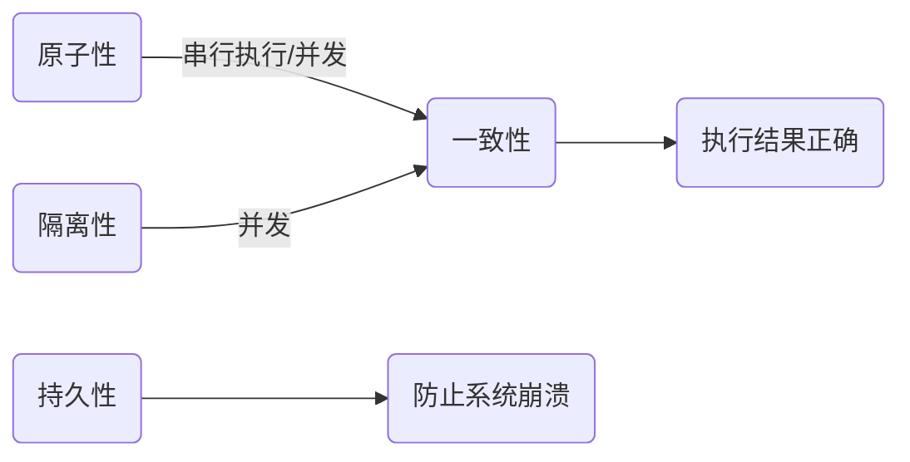
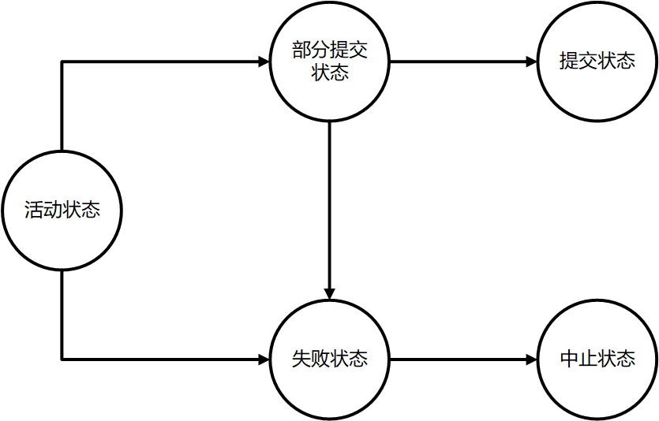

[toc]

# 版权声明

- 数据库系列学习笔记来源于 Abraham Silberschatz，Henry F.Korth 和 S.Sudarshan 所著 *Database System Concepts 6th edition* [1]；
- 该系列笔记不以盈利为目的，仅用于个人学习、课后复习及科学研究；
- 如有侵权，请与本人联系（hqpan@foxmail.com），经核实后即刻删除；
- 本文采用 [署名-非商业性使用-禁止演绎 4.0 国际 (CC BY-NC-ND 4.0)](https://creativecommons.org/licenses/by-nc-nd/4.0/deed.zh) 协议发布；

# 1. 数据库基本概念

## 1.1 定义

- DBS：Database System，数据库系统；
  - 数据库：相互关联的数据集合；
  - 访问数据的应用程序；
- DBMS：database management system，E.g. MySQL;
- SQL:  Structured Query Language ，结构化查询语言；
  - 发音：为字母 S-Q-L 或 sequel ['sikwəl] ；
  - query，n. & vt. 查询；
- UML：Unified Modeling Language，统一建模语言，unify，vt. 统一；
- 数据文件：即存储数据库自身；
- 数据字典：存储关于数据库结构的元数据，尤其是数据库模式；
- 索引：便于快速访问数据项；
- 数据库系统性能的度量指标：
  - 吞吐量：给定时间内完成任务的数量；
  - 响应时间：完成单个任务所需时间；

## 1.2 数据视图

- 数据抽象：
  - 物理层；
  - 逻辑层：
    - 数据间的关系，与物理层之间存在物理数据独立性；
    - 物理数据独立性：应用程序不依赖于物理模式；
  - 视图层；
- 实例：某个时刻数据库中所有信息特定取值的集合；
- 模式：schema，数据库的总体设计，描述表的特性，E.g. 表中包含何种数据、数据如何分解、如何存储、各部分信息如何命名、各个表之间的关系；
  - 物理模式：在物理层描述数据库的设计；
  - 逻辑模式：在逻辑层描述数据库的设计，使用该模式构造应用程序；
  - 子模式：subschema，即数据库在视图层的模式；
- 数据模型：描述数据之间的关系；
  - 关系模型：表示数据间的关联；
  - 实体-关系模型：entity-relationship model，E-R；
  - 基于对象的数据模型：即面向对象的数据模型；
  - 半结构化数据模型：允许相同的数据项具有不同的属性集，E.g. XML 可用于表示半结构化数据；

## 1.3 数据库语言

- 数据库语言的不同部分;
  - DDL：数据定义语言，输出存放在包含元数据的数据字典中，数据字典仅能由 DBS 自身访问和修改；
  - DML：数据操纵语言；
- 一致性约束：
  - 域约束：每个属性均有对应的取值范围约束；
  - 参照完整性约束：某些属性集在不同关系中出现，其值必须相等；
  - 断言；
  - 授权：给每个用户不同的权限；

## 1.4 事务管理

- 事务正确执行的四个基本要素：简写为 ACID；
  - 原子性：Atomicity；
  - 一致性：Consistency；
  - 隔离性：Isolation，若两个事务运行在相同的时间内，执行相同的功能，事务的隔离性将确保每一事务在系统中认为只有该事务在使用系统；
  - 持久性：Durability；

## 1.5 数据库体系结构

- 数据库体系结构:
  - 集中式数据库；
  - 客户机/服务器系统；
  - 并行数据库系统；
  - 分布式数据库系统；

# 2. 关系模型相关定义

- 数据库模式和数据库实例：
  - 数据库模式：数据库的逻辑设计；
  - 数据库实例：特定时刻下的快照；
- 关系：关系是集合，其中不含重复元组；
  - 关系实例：包含一组特定的行；
  - 关系模式：属性、属性类型、各属性的值域、关系上的约束；
  - 关系模型：用表的集合表示数据间的联系；
- 域：属性的值域；
- 属性：指代列；
- 导出列：即给列取别名；
- field：字段/计算字段，计算后得到的列，便于区分表中原有的列；
- 行：亦称记录；
- n 元组：有 n 个值的元组，对应于表中的一行；
- 超码：一个或多个属性的集合，可用于唯一标识一个元组；
  - 候选码：最小的超码；
  - 主码：即主键，被设计者选中，用于区分不同元组的候选码；
    - 主键值不能为空，不能修改、重用，若某行从表中删除，则它的主键不能赋给以后的新行；
    - 可取多个 column 组合作为主键；
- 外码：即外键，E.g. 关系$r_2$的主键是关系$r_1$中的属性；
  - $r_1$：外码依赖的参照关系；
  - $r_2$：外码的被参照关系；
- 参照完整性约束：参照关系中对应属性值相等；
- ==面试题== 外键的作用：
  - 关联两张表；
  - 实现参照完整性约束；
  - 保持数据一致性；
  - 注意：外键不能跨引擎使用，即使用外键关联的两张表应具有相同的引擎；
- ==面试题== 引擎：管理数据；
  - MyISAM：性能高，支持全文本搜索；
  - InnoDB：可靠，支持事务处理；

# 3. 形式化关系查询语言

## 3.1 基本关系代数运算

- 相容：指两个关系具有完全相同的属性；
- 关系代数基本运算：
  - 选择：筛选出满足给定条件的元组；
  - 投影：筛选出部分列，以集合形式（去重）返回；
  - 并：要求参与计算的关系是相容的；
  - 差：要求参与计算的关系是相容的；
  - 笛卡尔积：将两个关系中的元组拼接得到$n\times m$个元组，对于重名的属性使用关系名加以区分；
  - 更名；

## 3.2 附加的关系代数运算

- 附加的关系代数运算：
  - 交；
  - 自然连接：
    - 在笛卡尔积的基础上，仅拼接所有相同属性上具有相等值的元组，运算结果中不含重复属性；
    - 若两个关系中不含有相同属性，则自然连接的结果与笛卡尔积的结果相同；
  - 外连接：保留没有关联行的行；
    - 左外连接：保留左表中没有关联行的行，将缺失的内容记为 NULL；
    - 右外连接；
    - 全外连接；

## 3.3 扩展的关系代数运算

- 集合：不允许出现重复值，值出现的顺序是任意的；
- 多重集：允许出现重复值，值出现的顺序是任意的；
- 扩展的关系代数运算：聚集（使用聚集函数）；

# 4. 数据库设计和E-R模型

## 4.1 定义

- 度：参与联系集的实体集数量；
- 属性：
  - 组合属性：可划分为若干简单属性，E.g. address 可划分为 street、city、state 等信息；
  - 多值属性：E.g. 属性 phone_number 可能有多个值；
  - 派生属性：无需存储，可由基属性计算得到，E.g. date_of_bath 和 age；
- 约束：
  - 映射基数：一个实体通过一个联系集能关联的实体数量，E.g. 一对一，一对多……；
  - 参与约束：
    - total：实体集中的**所有**实体均参与到某个联系集中；
    - partial：实体集中的**部分**实体均参与到某个联系集中；

## 4.2 E-R 图

- E-R 图的组成部分：
  - 实体；
  - 属性；
  - 联系；
- 映射基数：一个实体通过一个联系集能关联的实体个数；
  - 一对一；
  - 一对多；
  - 多对一；
  - 多对多；
- 强实体集和弱实体集：
  - 强实体集：有主码；
  - 弱实体集：无主码，与标识实体集/属主实体集关联后才有意义；
- 标识性联系：弱实体集与标识实体集之间的联系；

# 5. 关系数据库设计

## 5.1 关系设计的特点

- 关系数据库的设计目标：设计满足适当范式的模式，避免存储信息冗余；
- 函数依赖：设 A​、B 为关系 R 的两个属性集合，若 R 中任意两个元组的 A 属性值相同时，其 B 属性值也相同，则称 A 函数决定 B ，或 B 函数依赖于 A；
  - 平凡的函数依赖：在所有关系中都成立的函数依赖；
  - 部分依赖：设对于属性集合 A、B，存在$A\rightarrow B$，且$A'$是 A 的真子集，若存在$A'\rightarrow B$，则称 B 部分函数依赖于 A；
  - 完全依赖：设对于属性集合 A、B，存在$A\rightarrow B$，若对于 A 的任一真子集$A'$，均不存在$A'\rightarrow B$，则称 B 完全函数依赖于 A；
  - 传递函数依赖：设 A、B、C 是互不相同的属性集合，若存在$A\rightarrow B$，$B\rightarrow C$，则称 C 传递函数依赖于 A；
- 有损分解和无损分解：
  - 有损分解：将一个模式分解为多个模式后，产生信息丢失；
  - 无损分解；
- 表达数据库一致性约束的方式：
  - 主码约束；
  - 函数依赖；
  - check 约束；
  - 断言；
  - 触发器；
- 不符合范式的关系可能产生的异常;
  - 数据冗余；
  - 修改异常：仅修改一个记录中的信息，而另一个记录中的信息未被修改；
  - 删除异常：删除一个信息后，可能丢失其它信息；
  - 插入异常：例如，无法插入新成立的学院信息，直至其拥有第一位教师；

## 5.2 范式

- 原子域：E.g. `CS224`不是一个原子域，其中子字符串具有单独的含义；
- $F^+$：表示集合$F$的闭包，即能从$F$集合推导出的所有函数依赖的集合；
- ==面试题== 第一范式：1 NF;
  - 关系模式中所有属性的域均不可分；
  - 无组合属性和多值属性；
- ==面试题== 第二范式：2 NF，非主键属性完全依赖于主键属性；
  - 解决方案：通过关系分解消除部分依赖；
  - 不符合第二范式的关系可能出现数据冗余，或在增删改等过程中出现异常；
- ==面试题== 第三范式：3 NF，在满足第二范式的基础上，关系中不存在非主键属性**传递函数依赖于**主键属性；
  - 解决方案：通过关系分解消除传递依赖；
  - 不符合第三范式的关系也可能存在数据冗余和增删改等操作异常；
  - 第三范式允许某些 BCNF 中不允许的函数依赖；
- ==面试题== Boyce-Codd 范式：不存在“任意一个非平凡的函数依赖$A\rightarrow B$，其中 A 不是关系的超码”；
  - Boyce-Codd Normal Form，BCNF，可消除所有基于函数依赖能够发现的冗余；
  - 满足 BCNF 的关系不是保持依赖的，不利于执行检查函数依赖的计算；
  - 任何满足 BCNF 范式的模式必定满足第三范式；

# 6. 数据存取

## 6.1 索引

- 元数据：存储在数据字典或系统目录中；
  - 关系名；
  - 关系中各属性名；
  - 属性的域和长度；
  - 视图名及其定义；
  - 完整性约束；
  - 索引名、被索引的关系名；
- 索引的类型;
  - 顺序索引：将值按顺序排序；
  - 散列索引：通过散列函数，将值均分到若干散列桶中；
- 评价索引性能的指标：
  - 访问类型：E.g. 查找具有特定属性值的记录，查找属性值落入特定范围内的记录；
  - 访问时间；
  - 插入时间；
  - 删除时间；
  - 空间开销；

## 6.2 顺序索引

- 聚集索引和非聚集索引：
  - 聚集索引：亦称主索引，记录按照搜索码指定的顺序排序；
  - 非聚集索引：
    - 亦称辅助索引，记录未按照搜索码指定的顺序排序；
    - 索引不直接指向文件，而是指向一个包含文件指针的桶；
- 顺序索引：按顺序存储搜索码的值；
  - 稠密索引：
    - 为每个搜索码创建一个索引项；
    - 索引项指向具有该搜索码值的第一条数据记录；
    - 注意：在稠密非聚集索引中，索引应指向存有相同搜索码值的指针列表；
    - 优点：查询速度快；
  - 稀疏索引：
    - 仅为部分搜索码创建索引项；
    - 注意：仅当索引为聚集索引时，才能使用稀疏索引；
    - 优点：空间开销小，插入和删除记录时的维护开销小；
  - 折中的索引方案：为每个块建立稀疏索引；
    - 数据库查询的主要时间开销：将块从磁盘上读入到主存中；
    - 块被读入到主存后，扫描整个块的时间开销可忽略不计；
  - 多级索引：由于索引项总是有序的，因此为原始索引项构建稀疏的外层索引；

## 6.3 B+ 树索引文件

### 6.3.1 B+ 树的结构

- B+ 树：balanced，一种平衡树结构，也是一种多级索引结构；
  - 为什么需要 B+ 树：顺序索引中，随着文件的增大，顺序索引的查找效率下降；
  - 节点组成：
    - 包含至多$n-1$个搜索码值，至少$\llcorner\frac{n}{2}\lrcorner$个搜索码值（$\llcorner\lrcorner$表示向下取整），$n$个指针；
    - 根节点包含的指针数量可小于$\llcorner\frac{n}{2}\lrcorner$；
    - 第$i$个指针$P_i$指向具有搜索码值$K_i$的记录；
    - 第$n$个指针指向同层中的下一个兄弟节点；
  - 优点：插入、修改、查找效率较高；

# 7.  事务管理

## 7.1 事务的特性

- ==面试题== 事务的特性：ACID；
  - Atomicity：原子性，事务不可分，其中的所有操作或者全部执行，或者均不执行；
    - 由恢复系统实现；
    - 借助回滚日志记录信息，若事务中止，则通过日志回滚；
  - Consistency：一致性，事务执行前后，数据库保持一致性状态；
    - 由编写事务的开发人员实现；
  - Isolation：隔离性，事务执行过程中，对其它事务不可见；
    - 由并发控制系统实现；
  - Durability：持久性，事务提交后，其对数据库的修改被永久保存；
    - 由恢复系统实现；
    - 借助重做日志，为已崩溃的系统恢复数据；

## 7.2 事务的状态

- 事务的状态：
  - 活动状态：初始状态，即事务执行时所处状态；
  - 部分提交状态：事务的最后一条语句执行完毕后，实际输出结果仍可能临时驻留在内存中；
  - 事务状态下的两种选择：
  - 中止状态；
  - 失败状态；
- 中止状态下的两种选择：
  - 重启事务：当硬件错误引发事务中止时适用；
  - 杀死事务：当事务内部的逻辑错误引发事务中止时适用；

## 7.3 并发一致性问题

- ==面试题== 并发一致性问题：
  - 丢失修改：E.g. 事务$T_i$、$T_j$先后修改同一数据项时，后者将覆盖前者；
  - 脏读：当前事务读取了其它未提交事务修改的数据；
  - 不可重复读：在当前事务两次读取同一数据项期间，数据项被另一事务修改；
  - 幻影读：
    - 本质上属于一种不可重复读；
    - 事务$T_i$读取某个范围内的数据时，$T_j$在该范围内插入新的数据，当$T_i$再次读取数据时，无法得到相同结果；
- 事务隔离性被破坏，将导致并发一致性问题，可通过并发控制保证隔离性；

## 7.4 可串行化

- 并发的优势：
  - 提高吞吐量和资源利用率；
  - 减少事务的平均响应时间；
- 并发控制系统的作用：实现可串行化调度，即并发调度的结果等价于串行调度；
- 冲突：对于事务 I 和 J，仅当其对同一数据项操作，且至少有一个 write 指令时，I 和 J 是冲突的；

|    事务 I    |    事务 J    | 是否冲突 |
| :----------: | :----------: | :------: |
| I = read(Q)  | J = read(Q)  |    F     |
| I = read(Q)  | J = write(Q) |    T     |
| I = write(Q) | J = read(Q)  |    T     |
| I = write(Q) | J = write(Q) |    T     |

- 冲突等价：若调度$S$通过一系列非冲突指令交换，转换为$S'$，则称调度$S$是冲突可串行化的；
- 冲突可串行化：若调度$S$与一个串行调度$S'$冲突等价，则称调度$S$是冲突可串行化的；

## 7.5 可恢复性

- 可恢复性：确保事务的原子性，即当事务$T_i$失败时，依赖于$T_i$的所有事务（即读取了$T_i$所写数据项的事务）也随之中止；
- 可恢复调度：对于事务$T_i$和$T_j$，若事务$T_j$读取了$T_i$所写的数据项，则应确保$T_i$先于$T_j$提交；
- 级联回滚：因某个事务故障引发一系列事务回滚；
- 无级联调度：
  - 若事务$T_j$读取了由$T_i$所写的数据项，则$T_i$必须在$T_j$这一读操作前提交；
  - 由定义可知，无级联调度也是可恢复调度；
- ==面试题== 事务隔离性级别：
  - 可串行化：
    - 不会出现并发一致性问题；
    - 实现方式：需要加锁，确保事务串行执行；
  - 可重复读：确保同一事务多次读取同一数据项，结果一致；
  - 已提交读：一个事务只能读取已提交的事务所做的修改，即未提交的事务所做的修改对其它事务不可见；
  - 未提交读：未提交的事务所做的修改对其它事务可见；
  - 注意：以上所有隔离性级别均不允许脏写，即当一个数据项被另一个尚未提交的事务写入时，不允许对该数据项执行写操作；
- 隔离级别处理并发一致性问题：

|          | 脏读 | 不可重复读 | 幻影读 |
| :------: | :--: | :--------: | :----: |
| 可串行化 |  T   |     T      |   T    |
| 可重复读 |  T   |     T      |   F    |
| 已提交读 |  T   |     F      |   F    |
| 未提交读 |  F   |     F      |   F    |

## 7.6 并发控制

### 7.6.1 并发控制机制

- 并发控制：确保多个事务并发执行时，仍能保持事务的隔离性；
- 并发控制机制：
  - 两阶段封锁；
  - 快照隔离；

### 7.6.2 封锁类型

- 读写锁：事务对某个数据项申请适当的锁，被并发控制管理器授予后，才能对数据项进行操作；
  - 共享锁：shared，写锁，亦称 S 锁；
  - 排它锁：exclusive，读锁，亦称 X 锁；
- 读写锁的相容性：

|       |  S   |  X   |
| :---: | :--: | :--: |
| **S** |  T   |  F   |
| **X** |  F   |  F   |

- 在读写完成后立即解锁，可能进入不一致的状态，应在事务完成后解锁；
- 当发生死锁时，系统将回滚其中一个事务，被其锁住的数据项随之解锁；
- 意向锁：支持多粒度封锁；
  - 共享型意向锁：intension-shared mode，IS 锁；
    - 表明当前节点的子节点将会加共享锁；
    - 事务如需对某行加 S 锁，则需先对表加 IS 锁；
  - 排他型意向锁：intension-exclusive mode，IX 锁；
    - 表明当前节点的子节点将会加排他锁；
    - 事务如需对某行加 X 锁，则需先对表加 IX 锁；
- 意向锁的兼容性：
  - IS、IX 之间是兼容的，因为意向锁的含义是对表加锁，而非对行加锁；
  - E.g. 事务$T_i$对表加 IS 锁，对某一行加 S 锁；事务$T_j$对表加 IX 锁，对表中的另一行加 X 锁，两事务均可正常执行；

|        |  IS   |   S   |  IX   |  X   |
| :----: | :---: | :---: | :---: | :--: |
| **IS** | ==T== | ==T== | ==T== |  F   |
| **S**  | ==T== | ==T== |   F   |  F   |
| **IX** | ==T== |   F   | ==T== |  F   |
| **X**  |   F   |   F   |   F   |  F   |

### 7.6.3 封锁协议

- 封锁协议：规定何时对数据项的加锁和解锁，使得冲突可串行化调度，从而确保隔离性；
- $T_i\rightarrow T_j$：若事务$T_i$先于$T_j$取得了某个数据项的锁，且两事务的锁不相容，则在串行调度中，$T_i$应出现在$T_j$之前；
- 两阶段封锁协议：仍有可能发生死锁；
  - 增长阶段：事务只能申请锁，不能释放锁；
  - 缩减阶段：
- 封锁点：在两阶段协议中，事务最后一次获得锁的位置，即增长阶段的结束点；
  - 多个事务根据封锁点的位置排序，即为可串行化顺序；
- 多粒度封锁协议：封锁粒度越小，则并发程度越高，但系统开销也越大；
  - 使用树结构表示不同层次的数据粒度，根节点表示整个数据库，其子节点表示各个区域，各区域的子节点为文件，文件的子节点为行（记录）；
  - 对不同层次的节点加锁，即可实现多粒度封锁；
  - 如需对某个节点申请加锁，需给目标节点的全部祖先节点加上意向锁，因此事务无需遍历整棵树，即可判定是否能够为该节点成功加锁；
- 三级封锁协议：
  - 一级封锁协议：
    - 事务修改数据时加 X 锁，事务结束后再释放锁；
    - 避免事物的修改被覆盖，解决丢失修改问题；
  - 二级封锁协议：
    - 在一级封锁协议的基础上，要求读取数据时加 S 锁，读取结束后释放 S 锁；
    - 避免脏读；
  - 三级封锁协议：
    - 在二级封锁协议的基础上，要求读取数据时加 S 锁，事务结束后释放 S 锁；
    - 避免不可重复读；

# Unsolved

- 通过 Commit 提交事务，通过 Rollback 回滚事务；
- ==面试题== 乐观锁、悲观锁？ 
- ==面试题== 索引？

# TODO

- 当前进度：Page 263，Chapter 10.8.1 已完成；
- 处理所有面试题；
- 笔记整理：已完成；

# References

[1] Abraham Silberschatz, Henry F.Korth, S.Sudarshan. 数据库系统概念[M]. 机械工业出版社, 2013. 