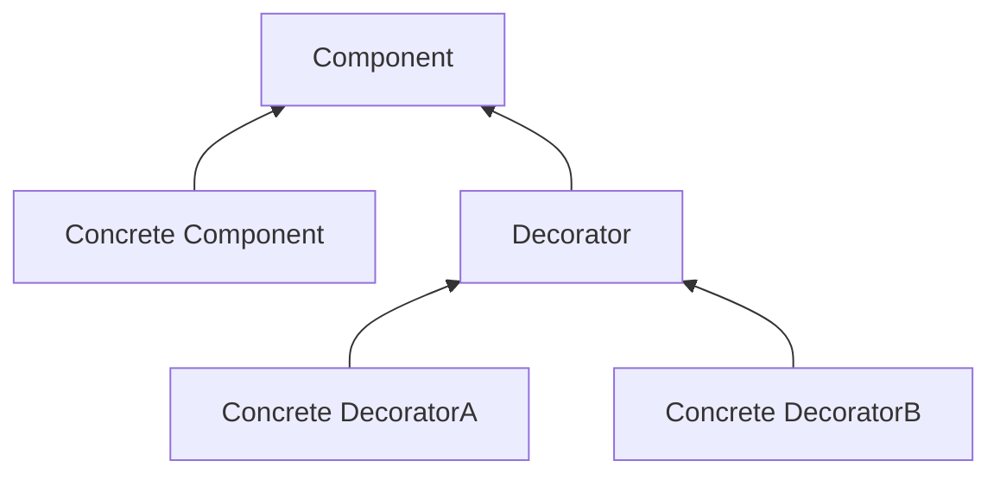
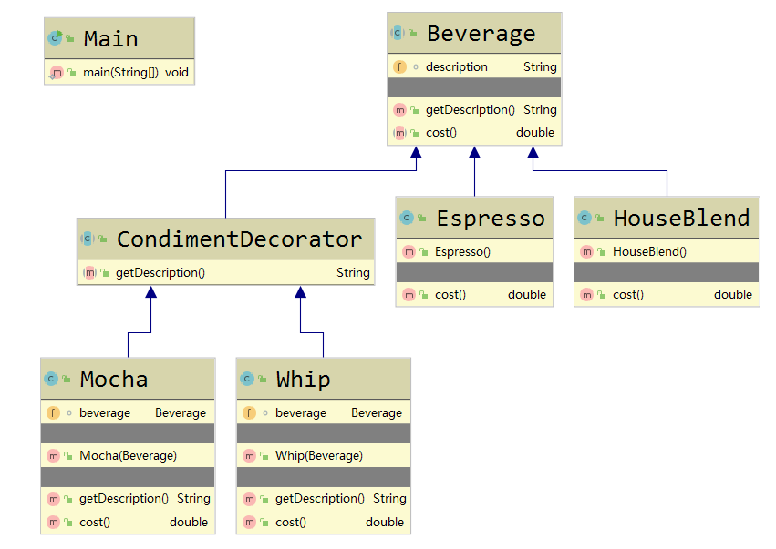
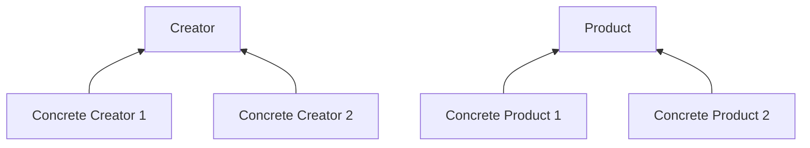
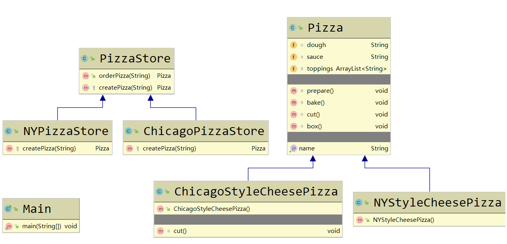
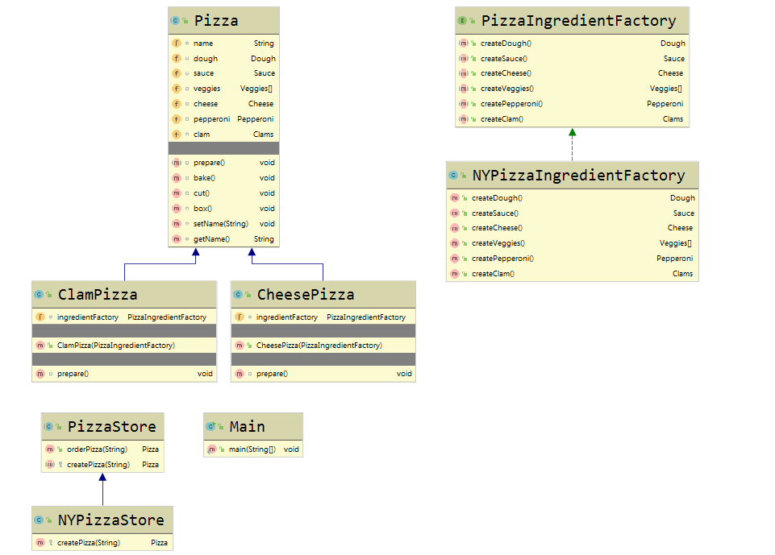

[TOC]
# 版权声明

- 设计模式系列学习笔记来源 Eric Freeman，Elisabeth Freeman with Kathy Sierra 和 Bert Bates 的著作《Head First 设计模式》[1]；
- 该系列笔记不以盈利为目的，仅用于个人学习、课后复习及科学研究；
- 如有侵权，请与本人联系（hqpan@foxmail.com），经核实后即刻删除；
- 本文采用 [署名-非商业性使用-禁止演绎 4.0 国际 (CC BY-NC-ND 4.0)](https://creativecommons.org/licenses/by-nc-nd/4.0/deed.zh) 协议发布；

# 1. Overview

## 1.1 Overview

- OO：Object-Oriented，adj. 面向对象的；
  - 封装、抽象、继承、多态； 
- 弹性设计：代码复用、可扩展、可维护：
- 代码复用：
  - 继承：子类行为在编译时静态决定，所有子类将继承相同的行为；
  - 组合：在运行时动态扩展对象行为，且增加新功能时，无需修改现有代码；
  - 委托：在运行时动态扩展对象行为；
- 设计原则：
  - 找出需要被频繁修改的代码，将其与稳定的代码分隔开；
  - 针对接口（或抽象类）编程，而非针对实现编程；
  - 多用组合，少用继承；
    - E.g. 通过组合使用不同的类实现特定行为；
  - 尽可能使得2个交互对象之间为松耦合；
  - 类对扩展开放，对修改关闭；
    - 注意：不是每个部分均适用该原则，否则将使得代码过于复杂，难以理解；
  - 依赖倒置原则：依赖抽象，不依赖具体类；
    - 变量不持有对具体类的引用；
    - 使类不派生于具体类；
    - 不覆盖基类中已实现的方法；
  - “最少知识”原则：减少类之间的交互；
  - 好莱坞原则：高层组件可调用底层组件，但底层组件不可调用高层组件；
    - 高层组件：决定底层组件参加计算的时间和方式；
    - 底层组件：执行具体计算；


## 1.2 模式功能对比

- 模式功能对比：
  - 工厂模式：封装对象的创建过程；
  - 命令模式：封装请求；
  - 外观模式：封装复杂接口；
- 策略模式和模板方法模式：均用于封装算法；
  - 策略模式：组合；
  - 模板方法模式：继承；
  - 工厂方法模式：一种特殊的模板方法模式；


# 2. 策略模式

## 2.1 Overview

- ==面试题== 简述策略模式：Strategy Pattern；
  - 定义算法族，并分别封装，算法之间可相互替换；
  - 优点：使得算法的变化独立于使用算法的客户；


## 2.2 UML 示例


# 3. 观察者模式

## 3.1 Overview

- ==面试题== 简述观察者模式：Observer Pattern，观察者模式，定义主题和观察者之间的依赖关系，当主题发生改变时，所有观察者都将收到通知；
  - Subject：主题，是一个具有状态的对象；
  - Observer：观察者，使用不属于自身的状态（即主题的状态）；
- 松耦合设计更有弹性：E.g. 观察者模式中的主题和观察者；
  - 2个对象之间可交互，但无需关注彼此的细节;
  - 改变松耦合对象中的任意一方，对另一方无影响；
- 观察者模式的数据交互方式：
  - “推数据”：Subject 将数据传递给各个观察者；
  - “拉数据”：各个观察者调用 Subject 中的 getter 方法获取数据；


## 3.2 UML 示例


# 4. 装饰者模式

## 4.1 Overview

- Decorator Pattern：装饰者模式，动态地为对象增加责任，相较于继承，装饰者模式在实现功能扩展时更有弹性；
  - 缺点：设计中出现较多对象，过度使用装饰者模式将使程序较为复杂；
- Q：为什么在装饰者模式中会用到继承？
  - 在装饰者模式中，被装饰者和装饰者继承自同一个父类；
  - 使用继承，确保被装饰者和装饰者“类型匹配”，使得装饰者可取代被装饰者，不同于以**获取父类行为**为目的的继承；
  - 装饰者模式的行为来自被装饰者、装饰者之间的组合；
- Q：为什么被装饰者和装饰者的父类是一个抽象类，而非一个接口？
  - 常将被装饰者和装饰者的父类设计为一个抽象类，在 Java 中也可将其设计为一个接口；


## 4.2 UML 示例

- 装饰者模式：
  - 每个组件可单独使用，亦可被装饰者包装后使用；
  - 装饰者中含有一个实例变量，用于保存某个组件的引用，即装饰者“包装”了组件；
  - Decorator 是装饰者共同实现的接口或抽象类；




- UML 示例：




# 5. 工厂模式

## 5.1 工厂方法模式

### 5.1.1 Overview

- Factory pattern：工厂模式，封装**对象的创建过程**；
  - 工厂方法模式；
  - 抽象工厂模式；
- 工厂方法模式：把对象的创建委托给子类，在子类中实现工厂方法，创建对象，将客户程序和具体类解耦；
  - 工厂方法：是一个抽象方法；
  - 创建者类：是一个抽象类，含有一个工厂方法和对实例化对象进行操作的方法；
  - 具体创建者类：
    - 继承创建者类，实现工厂方法，并在工厂方法中完成对象实例化；
    - 可根据需要，创建多个不同的具体创建者类；
  - 产品类：是一个抽象类；
  - 具体产品类：继承产品类，为产品类中的状态赋值；
- 静态工厂：将工厂定义为一个静态方法；
  - 优点：相较于将工厂定义为一个类，静态工厂无需实例化对象；
  - 缺点：无法通过继承改变方法的行为；


### 5.1.2 UML 示例

- 工厂方法模式：



- UML 示例：




## 5.2 抽象工厂模式

### 5.2.1 Overview

- 抽象工厂模式：
  - 提供一个接口，便于客户创建产品家族，无需指定具体产品类，使得客户和产品解耦；
  - 抽象工厂中的每个方法都是工厂方法；
- 工厂方法和抽象工厂的区别：
  - 工厂方法：通过继承创建对象，即扩展一个类来创建对象，并覆写工厂方法；
  - 抽象工厂：通过对象的组合，创建对象；


### 5.2.2 UML 示例




# 6. 单例模式

## 6.1 Overview

- ==面试题== Singletom pattern：单例模式，亦称单件模式；
  - 确保1个类仅有1个实例；
  - 提供1个全局访问点；
- 全局变量和单例模式的对比：
  - 全局变量：
    - 不能确保仅产生1个实例；
    - 必须在程序一开始就创建对象；
    - 若运行过程中长时间未使用该对象，将浪费大量资源；
  - 单例模式：
    - 确保仅产生1个实例；
    - 通过延迟实例化，可在需要时创建对象；
- 若程序中使用单例模式，且使用多个类加载器，则各个类加载器可能产生各自的实例；
  - Solution：自行指定同一个类加载器；


## 6.2 程序示例

### 6.2.1 饿汉式和懒汉式对比

- 饿汉式：在单例模式类被加载时，完成实例创建；
  - 线程安全；
  - 若运行过程中长时间未使用该对象，将浪费大量资源；
- 懒汉式：用户第一次获取实例时，完成实例创建；
  - 非线程安全，需要改进；
    - Approach 1：使用`synchronized`关键字，将方法定义为同步方法；
      - 仅当第一次获取实例时，需要同步，实现线程安全；
      - 此后若仍有同步，将使程序性能下降；
    - Approach 2：使用`volatile`关键字，双重检查加锁；
      - 仅当第一次获取实例时，进行同步，实现线程安全；
      - 此后不再进行同步，提升程序性能；


### 6.2.2 饿汉式程序

- ==面试题== 手写单例模式——饿汉式程序：

```java
public class Singeton {
    private static Singleton uniqueInstance = new Singleton();
    
    private Singleton() {}
    
    public static Singleton getInstance() {
        return uniqueInstance;
    }
}
```


### 6.2.3 懒汉式程序

- ==面试题== 手写单例模式——饿汉式程序：
  - Approach 1：使用`synchronized`关键字，将方法定义为同步方法；
  - Approach 2：使用`volatile`关键字，双重检查加锁；

```java
// Approach 1: synchronized
public class Singleton {
    private static Singleton uniqueInstance;
    
    private Singleton() {}
    
    public static synchronized Singleton getInstance() {
        if (uniqueInstance == null)
            uniqueInstance = new Singleton();
        return uniqueInstance;
    }
}
```

```java
// Approach 2: volatile
public class Singleton {
    private volatile Singleton uniqueInstance;
    
    private Singleton() {}
    
    public static Singleton getInstance() {
        if (uniqueInstance == null) {
            synchronized (Singleton.class) {
                if (uniqueInstance == null)
                    uniqueInstance = new Singleton();
            }
        }
    }
}
```


# 7. 命令模式

## 7.1 Overview

- Command pattern：命令模式，将请求封装为对象，以便使用不同的请求、队列、日志请求，参数化其它对象，该模式亦支持撤销操作；
  - 解耦对象：将“动作请求者”、“动作执行者”对象解耦，两者通过命令对象沟通；
  - 命令对象：封装接收者、一个或一组动作；
  - 宏命令：一次执行多个命令；
- 命令模式的用途：队列请求、日程安排、线程池、工作队列、日志请求、事务系统（ACID 特性）；
- invoker，n. 调用者，请求者；
- slot，n. 狭槽，投币口，水沟；


## 7.2 命令模式

- 定义一个 Command 接口，所有命令均需实现该接口；
- 调用者通过 Command 接口调用命令，无需了解命令细节；


# 8. 适配器模式和外观模式

## 8.1 Overview

- 模式功能对比：
  - 装饰者模式：不改变接口，但增加新的功能；
  - 适配器模式：将一个接口转换为另一个接口；
  - 外观模式：简化接口，使得一个复杂的子系统或多个子系统易于使用；


## 8.2 适配器模式

- 适配器模式：Adapter Pattern，实现接口转换，将用户不兼容的接口转换为用户兼容的接口；
  - 解耦对象：将客户和被适配者解耦；
- 适配器模式体现的设计原则：
  - 使用对象组合，用修改的接口包装被适配者；
  - 面向接口编程，而非面向实现编程；


## 8.3 外观模式

- 外观模式：定义一个高层接口，避免使用子系统中多个接口带来的不便；
  - 使客户和子系统解耦；
  - 简化接口的同时，仍将系统完整功能暴露给用户，以便满足用户的特殊需求；
  - 可为一个子系统设计多个外观模式；
- 外观模式体现的设计原则：
  - “最少知识”原则：避免用户和多个子系统交互；


# 9. 模板方法模式

- 模板方法模式：Template Method Pattern，定义算法步骤，将部分步骤的实现过程交给子类实现；
  - 模板方法：抽象类中实现一个`final`方法，避免被子类覆盖，该方法按特定顺序调用不同方法，完成操作过程；
  - 抽象类中还含有若干抽象方法、具体方法和 hook：
    - 抽象方法：由子类实现个性化操作；
    - 具体方法：由该类实现共性操作；
    - hook()：n. 钩子，vt. & vi. 勾住；
      - 让子类根据需要完成具体操作，换言之，子类通过“钩子”将代码插入至抽象类预设的操作流程中；
      - 在抽象类中实现一个具体方法，该方法不执行任何操作或仅执行默认操作，子类可根据需要决定是否覆盖该方法，从而完成某些操作；
      - 子类可通过“钩子”作为判断条件，干涉模板方法中的操作步骤；


# 10. 迭代器模式和组合模式

## 10.1 Overview

- 迭代器模式：iterator pattern；
  - 封装内容：遍历集合对象的过程；
  - 优点：客户无需了解集合对象的内部表示，即可完成遍历过程；
- java.util.Iterator 接口：提供`hasNext()`、`next()`、`remove()`方法；


# ==面试题==

- Q：Java IO 涉及哪些设计模式？
  - 装饰者模式；
  - 适配器模式；


# 待整理的内容


# ==Schedule==

- 正文页数：630；
  - 自03月13日起，每日23页，4月11日完成；
  - 当前进度：Page 338；
- 对照牛客网和面经，每天整理几个面试题；


# References

[1] Eric Freeman, Elisabeth Freeman with Kathy Sierra, Bert Bates. Head First 设计模式[M]. 北京: 中国电力出版社, 2007.