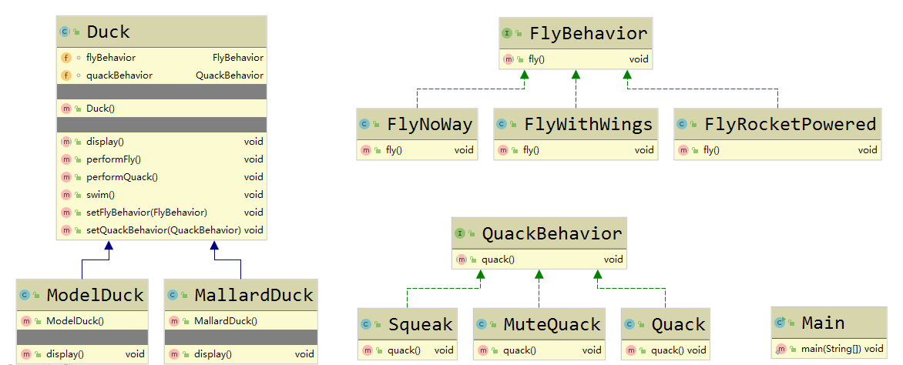
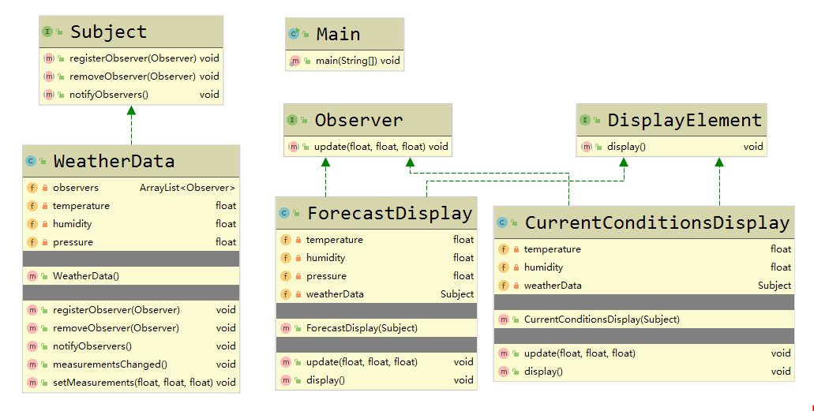

[TOC]
# 版权声明

- 设计模式系列学习笔记来源 Eric Freeman，Elisabeth Freeman with Kathy Sierra 和 Bert Bates 的著作《Head First 设计模式》[1]；
- 该系列笔记不以盈利为目的，仅用于个人学习、课后复习及科学研究；
- 如有侵权，请与本人联系（hqpan@foxmail.com），经核实后即刻删除；
- 本文采用 [署名-非商业性使用-禁止演绎 4.0 国际 (CC BY-NC-ND 4.0)](https://creativecommons.org/licenses/by-nc-nd/4.0/deed.zh) 协议发布；

# 1. Overview

- OO：Object-Oriented，adj. 面向对象的；
  - 封装、抽象、继承、多态； 
- 设计原则：
  - 找出需要被频繁修改的代码，将其与稳定的代码分隔开；
  - 针对接口（或抽象类）编程，而非针对实现编程；
  - 多用组合，少用继承；
    - E.g. 通过组合使用不同的类实现特定行为；
  - 尽可能使得2个交互对象之间为松耦合；

# 2. 策略模式

## 2.1 Overview

- Strategy Pattern：策略模式；
  - 定义算法族，并分别封装，算法之间可相互替换；
  - 优点：使得算法的变化独立于使用算法的客户；

## 2.2 策略模式 UML 示例

# 3. 观察者模式

## 3.1 Overview

- 观察者模式：Observer Pattern，定义主题和观察者之间的依赖关系，当主题发生改变时，所有观察者都将收到通知；
  - Subject：主题，是一个具有状态的对象；
  - Observer：观察者，使用不属于自身的状态（即主题的状态）；
- 松耦合：
  - 2个对象之间可交互，但无需关注彼此的细节，E.g. 观察者模式中的主题和观察者；
  - 改变松耦合对象中的任意一方，对另一方无影响；

## 3.2 Java 内置的观察者模式

- Java 内置的观察者模式支持“推数据”和“拉数据”；
  - java.util.Observable：该类即为主题；==应熟悉其中全部方法==
  - java.util 中的 Observer 接口：即观察者；==应熟悉其中全部方法==

## 3.3 观察者模式 UML 示例

# 待整理的内容

- 弹性设计：复用代码、可扩展性、可维护性：
  - 继承：存在一些缺陷；
  - 其它方法；

# ==Schedule==

- 正文页数：630；
  - 自03月13日起，每日21页，30天完成；
- 进度：
  - 当前进度：Page 66；
  - 延期页数：从03月16日起，每天额外增加2页；
    - 03月15日，21页；

# References

[1] Eric Freeman, Elisabeth Freeman with Kathy Sierra, Bert Bates. Head First 设计模式[M]. 北京: 中国电力出版社, 2007.