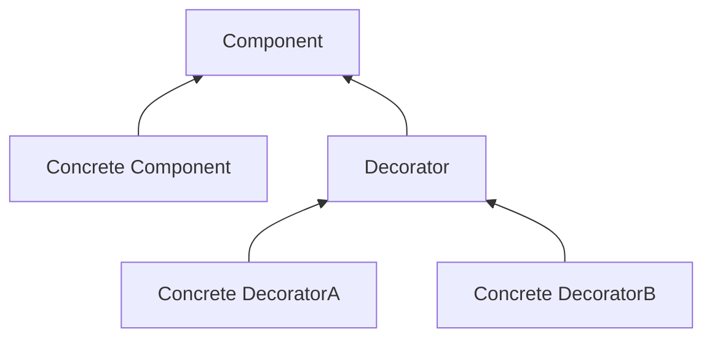
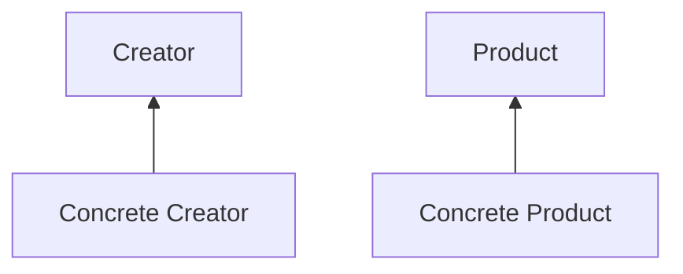

[TOC]
# 版权声明

- 设计模式系列学习笔记来源 Eric Freeman，Elisabeth Freeman with Kathy Sierra 和 Bert Bates 的著作《Head First 设计模式》[1]；
- 该系列笔记不以盈利为目的，仅用于个人学习、课后复习及科学研究；
- 如有侵权，请与本人联系（hqpan@foxmail.com），经核实后即刻删除；
- 本文采用 [署名-非商业性使用-禁止演绎 4.0 国际 (CC BY-NC-ND 4.0)](https://creativecommons.org/licenses/by-nc-nd/4.0/deed.zh) 协议发布；

# 1. Overview

- OO：Object-Oriented，adj. 面向对象的；
  - 封装、抽象、继承、多态； 
- 弹性设计：代码复用、可扩展、可维护：
- 代码复用：
  - 继承：子类行为在编译时静态决定，所有子类将继承相同的行为；
  - 组合：在运行时动态扩展对象行为，且增加新功能时，无需修改现有代码；
  - 委托：在运行时动态扩展对象行为；
- 设计原则：
  - 找出需要被频繁修改的代码，将其与稳定的代码分隔开；
  - 针对接口（或抽象类）编程，而非针对实现编程；
  - 多用组合，少用继承；
    - E.g. 通过组合使用不同的类实现特定行为；
  - 尽可能使得2个交互对象之间为松耦合；
  - 类对扩展开放，对修改关闭；
    - 注意：不是每个部分均适用该原则，否则将使得代码过于复杂，难以理解；

# 2. 策略模式

## 2.1 Overview

- Strategy Pattern：策略模式；
  - 定义算法族，并分别封装，算法之间可相互替换；
  - 优点：使得算法的变化独立于使用算法的客户；

## 2.2 UML 示例

# 3. 观察者模式

## 3.1 Overview

- Observer Pattern：观察者模式，定义主题和观察者之间的依赖关系，当主题发生改变时，所有观察者都将收到通知；
  - Subject：主题，是一个具有状态的对象；
  - Observer：观察者，使用不属于自身的状态（即主题的状态）；
- 松耦合设计更有弹性：E.g. 观察者模式中的主题和观察者；
  - 2个对象之间可交互，但无需关注彼此的细节;
  - 改变松耦合对象中的任意一方，对另一方无影响；
- 观察者模式的数据交互方式：
  - “推数据”：Subject 将数据传递给各个观察者；
  - “拉数据”：各个观察者调用 Subject 中的 getter 方法获取数据；

## 3.2 UML 示例

# 4. 装饰者模式

## 4.1 Overview

- Decorator Pattern：装饰者模式，动态地为对象增加责任，相较于继承，装饰者模式在实现功能扩展时更有弹性；
  - 缺点：设计中出现较多对象，过度使用装饰者模式将使程序较为复杂；
- Q：为什么在装饰者模式中会用到继承？
  - 在装饰者模式中，被装饰者和装饰者继承自同一个父类；
  - 使用继承，确保被装饰者和装饰者“类型匹配”，使得装饰者可取代被装饰者，不同于以**获取父类行为**为目的的继承；
  - 装饰者模式的行为来自被装饰者、装饰者之间的组合；
- Q：为什么被装饰者和装饰者的父类是一个抽象类，而非一个接口？
  - 常将被装饰者和装饰者的父类设计为一个抽象类，在 Java 中也可将其设计为一个接口；

## 4.2 UML 示例

- 装饰者模式：
  - 每个组件可单独使用，亦可被装饰者包装后使用；
  - 装饰者中含有一个实例变量，用于保存某个组件的引用，即装饰者“包装”了组件；
  - Decorator 是装饰者共同实现的接口或抽象类；

- UML 示例：

# 5. 工厂模式

## 5.1 Overview

- Factory pattern：工厂模式，封装**对象的创建过程**，在父类中声明对象并对对象执行相关操作，在子类中创建对象，避免耦合；
  - 工厂方法：是一个抽象方法；
  - 创建者类：是一个抽象类，含有一个工厂方法和对实例化对象进行操作的方法；
  - 具体创建者类：
    - 继承创建者类，实现工厂方法，并在工厂方法中完成对象实例化；
    - 可根据需要，创建多个不同的具体创建者类；
  - 产品类：是一个抽象类；
  - 具体产品类：继承产品类，为产品类中的状态赋值；
- 静态工厂：将工厂定义为一个静态方法；
  - 优点：相较于将工厂定义为一个类，静态工厂无需实例化对象；
  - 缺点：无法通过继承改变方法的行为；

## 5.2 UML 示例

- 工厂模式：

- UML 示例：

# 待整理的内容

# ==Schedule==

- 正文页数：630；
  - 自03月13日起，每日21页，30天完成；
- 进度：
  - 当前进度：Page 136；
  - 延期页数：从03月16日起，每天额外增加2页；
    - 03月15日，21页；
- 每天整理一个模式；

# References

[1] Eric Freeman, Elisabeth Freeman with Kathy Sierra, Bert Bates. Head First 设计模式[M]. 北京: 中国电力出版社, 2007.