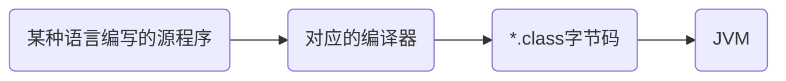
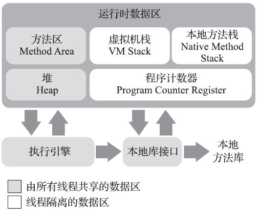
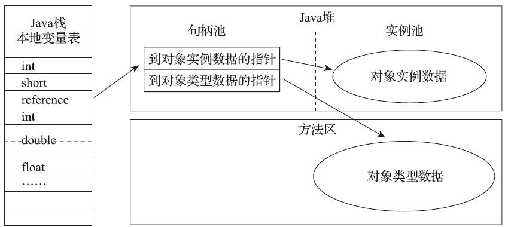
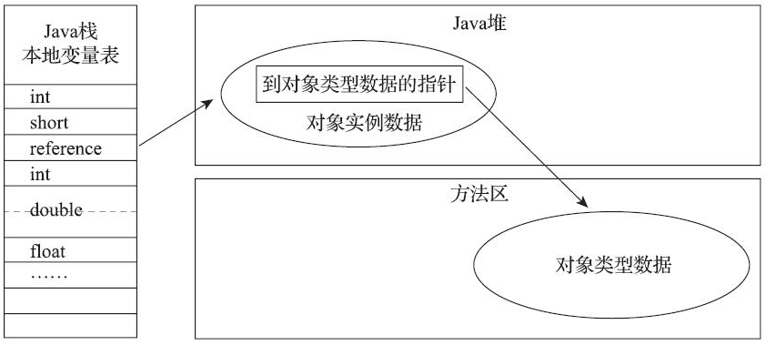
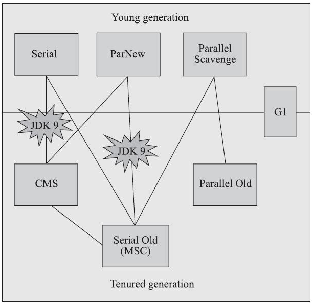
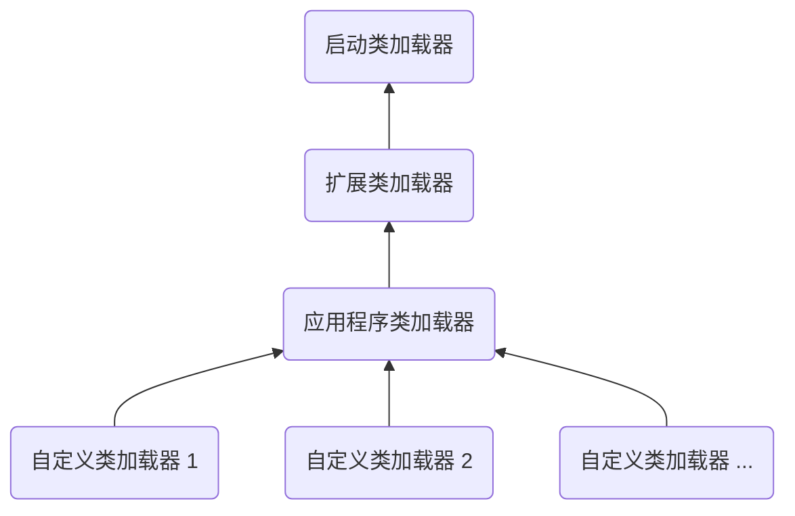

[toc]

# 版权声明

- JVM 学习笔记来源周志明的著作《深入理解 Java 虚拟机》[1]；
- 该系列笔记不以盈利为目的，仅用于个人学习、课后复习及科学研究；
- 如有侵权，请与本人联系（hqpan@foxmail.com），经核实后即刻删除；
- 本文采用 [署名-非商业性使用-禁止演绎 4.0 国际 (CC BY-NC-ND 4.0)](https://creativecommons.org/licenses/by-nc-nd/4.0/deed.zh) 协议发布；

# 1. Java 技术体系

- JCP：Java Community Process，Java 社区；
- JCP 定义的 Java 技术体系：
  - JDK：Java Development Kit，n.[C] 工具箱，支持 Java 程序开发的最小环境；
    - Java 程序设计语言；
    - Java 虚拟机：HotSpot 是 Sun/Oracle JDK 和 OpenJDK中的默认虚拟机，也是当前主流的虚拟机之一；
    - Java 类库 API；
  - `Class`文件格式；
  - 来自商业机构和开源社区的第三方 Java 类库；
- JRE：Java Runtime Environment，支持 Java 程序运行的标准环境；
  - Java SE API：Java 类库 API 的子集；
  - Java 虚拟机；
- 核心包和扩展包：
  - 核心包：`java.*`；
  - 扩展包：`javax.*`；
- STW：Stop the World，暂停用户线程；
- ==面试题== Java 是编译型语言还是解释型语言？
  - 先将源文件编译成与平台无关的字节码文件（`*.class`文件），后由 JVM 将字节码解释成机器码指令；
  - Java 既可认为是编译型语言，也可认为是解释型语言；

# 2. Java 内存区域与内存溢出异常

## 2.1 内存管理概述

- C++ 和 Java 在内存管理上的区别：
  - C++：用户需维护对象的创建和删除过程，为每个`new`操作编写对应的`delete/free`代码；
  - Java：JVM 提供内存动态分配和垃圾回收机制；
- 无关性：
  - 平台无关性：各种不同平台的 JVM 均可执行`*.class`文件中的二进制字节码；
  - 语言无关性：JVM 支持多种语言；

- ==面试题== JVM 的作用？
  - JVM 执行`*.class`文件中的二进制字节码，使 Java 语言具有平台无关性；
  - JVM 提供内存动态分配和垃圾回收机制；

## 2.2 运行时数据区域

### 2.2.1 基本概念

- ==面试题== 简述 JVM 内存模型？
  - 运行时数据区域见下表；
  - 各区域的功能：
    - 程序计数器：指示当前线程所执行的字节码的行号；
    - Java 虚拟机栈：
      - 每个方法被执行时，JVM 同步创建一个栈帧，用于存储局部变量表等信息；
      - 一个方法从被调用到执行完毕的过程，对应虚拟机栈中一个栈帧从入栈到出栈的过程；
    - 本地方法栈：HotSpot 将虚拟机栈和本地方法栈合二为一；
    - Java 堆：在堆上为所有对象实例和数组分配内存；
    - 方法区：存储已被虚拟机加载的类型信息等数据；

|       运行时数据区域       | 线程共享 or 线程隔离 |
| :------------------------: | :------------------: |
|         程序计数器         |       线程隔离       |
|       Java 虚拟机栈        |       线程隔离       |
|         本地方法栈         |       线程隔离       |
|          Java 堆           |       线程共享       |
| 方法区（包含运行时常量池） |       线程共享       |

- 数据区域的生命周期：
  - 随虚拟机进程启动而一直存在；
  - 随用户进程的启动、结束而建立、销毁；
- 概念模型：指所有虚拟机的统一外观，各款具体的虚拟机不一定完全按照概念模型的定义进行设计；

### 2.2.2 程序计数器

- ==面试题== 程序计数器：
  - 指示当前线程所执行的字节码的行号；
    - 若线程正在执行 Java 方法，则程序计数器记录正在执行的虚拟机字节码指令的地址；
    - 若线程正在执行本地（native）方法，则程序计数器值为空；
  - 字节码解释器通过程序计数器的值获取下一条待执行的字节码指令；
- 程序计数器中可能出现的异常：《Java 虚拟机规范》对除程序计数器以外的内存区域均规定了`OutOfMemoryError`（OOM）情况；

### 2.2.3 Java 虚拟机栈

- ==面试题== Java 虚拟机栈：描述 Java 方法执行的线程内存模型：
  - 每个方法被执行时，JVM 同步创建一个栈帧（Stack Frame），用于存储局部变量表、操作数栈、动态连接、方法返回地址等信息；
  - 一个方法从被调用到执行完毕的过程，对应虚拟机栈中一个栈帧从入栈到出栈的过程；
- 局部变量表：存放编译期可知的数据类型；
  - 基本数据类型：
    - boolean；
    - 1 字节：byte；
    - 2 字节：char、short；
    - 4 字节：int、float；
    - 8 字节：long、double；
  - 引用数据类型：
    - 指向对象起始地址的引用指针；
    - 指向一个代表对象的句柄或其它与此对象相关的位置；
    - returnAddress类型，指向一条字节码指令的地址；
  - 局部变量槽（Slot）：表示局部变量表中各数据类型的存储空间：
    - long、double 类型的数据占用 2 个变量槽，其余数据类型占用 1 个变量槽；
    - 局部变量表所需的内存空间在编译时完成分配，一个方法在栈帧中所需的局部变量空间大小是确定的，在方法运行期间局部变量表的大小不变；
    - 注意：局部变量表的大小为变量槽的数量，虚拟机实际使用的内存空间大小由具体的虚拟机实现方式决定，E.g. 1 个变量槽占用 32 个比特、1 个变量槽占用 64个比特……
- 虚拟机栈中可能出现的异常：
  - `StackOverflowError`：线程请求的栈深度大于虚拟机允许的深度；
  - `OutOfMemoryError`：
    - 若虚拟机栈容量可动态扩展，则当栈扩展时无法申请到足够的内存将抛出该异常；
    - HotSpot 的栈容量不可动态扩展，仅在线程申请栈空间失败时才可能抛出`OutOfMemoryError`；

### 2.2.4 本地方法栈

- ==面试题== 虚拟机栈和本地方法栈的区别：HotSpot 将虚拟机栈和本地方法栈合二为一；
  - 虚拟机栈：为 JVM 执行的 Java 方法（字节码）服务；
  - 本地方法栈：为 JVM 使用到的本地方法服务；
- 本地方法：一般用 C、C++ 或汇编语言等编写，并被编译为基于本机硬件和操作系统的程序；
- 本地方法栈可能出现的异常：同虚拟机栈；

### 2.2.5 Java 堆

- ==面试题== Java 堆：亦称 GC 堆，Garbage Collected Heap，是 JVM 管理的所有内存中最大的一块，在堆上为所有对象实例和数组分配内存；
  - 内存空间：
    - Java 堆可使用物理上不连续的内存空间；
    - 对于数组等大对象，多数虚拟机要求连续的内存空间；
  - 堆的结构：
    - 新生代：HotSpot 将新生代分区，内存空间占比为 8:1:1；
      - Eden：n. 伊甸园；
      - Survivor：n. 幸存者；
      - Survivor；
    - 老年代；
- Java 堆可能出现的异常：
  - `OutOfMemoryError`：Java 堆中的内存不足以完成实例空间分配，且堆无法扩展时，将抛出该异常；
- TLAB：Thread Local Allocation Buffer，可从 Java 堆中划分出多个线程私有的分配缓冲区，提高内存分配效率；
  - 多线程在为对象分配内存时，修改用于分配内存的指针将是线程不安全的，采用 TLAB 可解决该问题；

### 2.2.6 方法区

- ==面试题== 方法区：在 JDK 8 后使用元空间代替永久代实现方法区；
  - 用途：存储已被虚拟机加载的类型信息、常量、静态变量、即时编译器编译后的代码缓存等数据；
  - 特点：
    - 《Java 虚拟机规范》允许方法区不实现垃圾收集；
    - 垃圾收集行为在方法区不常见，该区域的内存回收目标是对常量池的回收和对类型的卸载；
- 运行时常量池：是方法区的一部分；
  - Class 文件中除了有类的版本、字段、方法、接口等描述信息外，还包括常量池表，用于存放编译期生成的各种字面量与符号引用；
  - 常量池表将在类加载后存放到运行时常量池中；
- 运行时常量池和`Class`文件常量池的差别：
  - `Class`文件常量池：存放编译期产生的常量；
  - 运行时常量池：具备动态性；
  - Java 语言中常量可在编译期产生，也可在运行期间将新的常量放入池中；
- 方法区可能出现的异常：
  - `OutOfMemoryError`：方法区无法满足新的内存分配需求；

### 2.2.7 直接内存

- 直接内存：不属于“运行时数据区域”；
  - NIO（New Input/Output）类：
    - 引入一种基于通道（Channel）与缓冲区（Buffer）的I/O方式；
    - 使用 Native 函数库直接分配堆外内存，通过存储在 Java 堆中的 DirectByteBuffer 对象引用该内存；
    - 由于避免了在 Java 堆和 Native 堆中来回复制数据，可在部分场景下提高性能；
- 直接内存可能出现的异常：
  - `OutOfMemoryError`：
    - 直接内存的空间分配不受 Java 堆的大小限制，但会受本机总内存大小和处理器寻址空间的限制；
    - 若各内存区域之和大于物理内存限制，则将抛出该异常；

## 2.3 HotSpot 中的数据细节

### 2.3.1 对象的创建

- 内存分配方法：Java 堆中可用内存的地址空间是否连续，取决于采用的垃圾收集器是否带有空间压缩整理的能力；
  - 指针碰撞：若 Java 堆中可用内存的地址空间连续，则使用一个指针指示当前可用的内存起始地址；
  - 空闲列表：若 Java 堆中可用内存的地址空间不连续，则 JVM 维护一个列表，记录可用的内存块地址；
- 为什么 Java 对象未赋初值即可使用？
  - 内存分配完成后，JVM 将分配到的内存空间（不包括对象头）初始化为默认值；
  - 若使用了 TLAB，则在 TLAB 分配时初始化默认值；
- 对象头：Object Header；

### 2.3.2 对象的内存布局

- 对象在堆内存中的存储布局可划分为三个部分：
  - 对象头；
  - 实例数据：对象中的有效信息；
  - 对齐填充；
- 对象头：
  - 存储对象自身的运行时数据：哈希码、GC 分代年龄、锁状态标志、线程持有的锁、偏向线程 ID、偏向时间戳……
    - 该部分数据的长度在32位和64位的虚拟机中分别为32个比特和64个比特，官方称之为“Mark Word”；
  - 类型指针：对象指向它的类型元数据的指针，JVM 通过该指针确定该对象是哪个类的实例；
    - 不是所有的虚拟机实现都必须在对象数据上保留类型指针，即查找对象的元数据信息并不一定要经过对象本身；
    - JVM 通过元数据信息确定对象大小；
  - 注意：若对象为数组，则对象头中还有一块记录数组长度的数据，JVM 即可由此确定数组大小；
- 对齐填充：
  - HotSpot 的自动内存管理系统要求对象起始地址必须是 8 字节的整数倍，即任何对象的大小都必须是 8 字节的整数倍；
  - 对象头部分已被设计好，恰为 8 字节的倍数，若对象实例数据未对齐，则需通过对齐填充，补全占位符；

### 2.3.3 对象的访问定位

- Java 程序通过栈上的引用数据类型操作堆上的对象；
- 引用数据类型访问对象的方式：
  - 使用句柄：
    - Java 堆中划分一块内存作为句柄池，引用对象中存储该对象的句柄地址，句柄中包含对象实例数据和类型数据的地址；
    - 优点：引用对象中存储该对象的句柄地址，当对象被移动时（垃圾收集时移动对象是常见行为），无需修改引用对象本身，仅需修改句柄中的实例数据指针；
  - 直接指针：
    - 引用对象存储该对象的地址；
    - 优点：由于不需要访问句柄，节省了一次指针定位的时间开销，速度更快；

## 2.4 处理 OutOfMemoryError

- Java 堆溢出：`java.lang.OutOfMemoryError: Java heap space`；
- 通过内存映像分析工具，分析由 Dump 得出的堆转储快照；
- ==面试题== 内存溢出和内存泄漏的区别？
  - 内存溢出：Java 堆的内存空间不足，无法为新对象分配内存空间；
  - 内存泄漏：已死亡的对象所占用的内存空间未被回收；
  - 内存泄漏最终会导致内存溢出；

# 3. 垃圾收集器与内存分配策略

## 3.1 垃圾收集概述

- 垃圾收集：GC，Garbage Collection；
- 内存分配和回收：
  - 程序计数器、虚拟机栈、本地方法栈：线程私有，当线程结束后，该数据区域消失，无需进行垃圾回收；
  - Java 堆和方法区：方法区垃圾回收条件苛刻，回收所得内存少；

## 3.2 对象状态

### 3.2.1 对象状态判断方法

- 垃圾回收前，需找出无法访问的对象；
- 判断对象是否存活的算法：
  - 引用计数算法；
  - 可达性分析算法；
- 引用计数算法：
  - 在对象中添加一个引用计数器；
  - 若该对象增加一个引用，则计数器加 1；
  - 若该对象的某个引用失效，则计数器减 1；
  - E.g. 若两个对象间循环引用，则引用计数器永不为 0，导致无法回收该对象；
- 可达性分析算法：JVM 使用该方法判定对象是否可被回收；
  - 通过若干名为 GC Root 的根节点集；
  - 根节点通过引用链指向子节点，即被引用对象；
  - 若 GC Root 至某个节点无可达路径，则对象应被回收；
- ==面试题== 可作为 GC Root 的对象：GC Root 位于全局性的引用或执行上下文中；
  - 虚拟机栈（栈帧中的本地变量表）中引用的对象；
  - 方法区中类静态属性引用的对象；
  - 方法区中常量引用的对象；
  - 本地方法栈中JNI（Java Native Interface，即本地方法）引用的对象；

### 3.2.2 对象的引用关系

- ==面试题== Java 中的四种引用关系？
- 强引用：
  - 使用`new`关键字创建强引用;
  - 若对象被强引用关联，则 GC 将不会回收该对象；
- 软引用：
  - 使用`SoftReference`类创建；
  - 系统发生内存溢出前，将回收被软引用关联的对象；
- 弱引用：
  - 使用`WeakReference`类创建；
  - 下一次 GC 开始工作时，将回收被弱引用关联的对象；
- 虚引用：其所关联的对象被 GC 回收时将收到系统通知；
  - 使用`PhantomReference`类创建；
  - 虚引用不影响被关联对象的生命周期；
  - 无法通过虚引用获取被关联的对象实例；

### 3.2.3 回收对象的过程

- finalize，vt. 完成，落实；
- 对象回收需经历 2 次标记过程：
  - 第 1 次标记：经可达性算法判定，对象与 GC Root 之间无引用链；
    - 判断对象是否有必要执行 finalize() 方法：
      - 没有必要执行 finalize() 方法：若对象未覆盖 finalize() 方法，或 finalize() 方法已被 JVM 调用过；
      - 有必要执行 finalize() 方法；
    - 若对象有必要执行 finalize() 方法，则将其置于名为 F-Queue 的队列中，稍后由一个被 JVM 自动建立的、低优先级的 Finalizer 线程执行对象的 finalize() 方法；
      - JVM 不承诺一定会等待对象的 finalize() 方法运行结束;
      - 避免因某对象的 finalize() 方法执行缓慢，或发生死循环，导致 F-Queue 队列中的剩余对象永久处于等待状态，引发内存回收子系统崩溃；
  - 第 2 次标记：收集器将对 F-Queue 中的对象进行第二次标记，若对象与引用链上的任一对象建立关联，则在第二次标记时将其移出“即将回收”的集合；
- 对象在回收过程中自救的机会仅有 1 次；
  - 一个对象的 finalize() 方法最多会被系统自动调用一次；
  - 当该对象第二次被回收时，finalize() 方法不再被执行；
- 在关闭外部资源时，try-finally 等方式更好，且finalize() 方法运行代价高，不确定性大，无法保证各个对象的调用顺序，官方不推荐使用该方法；

### 3.2.4 方法区垃圾收集

- 方法区垃圾回收的内容：
  - 常量池回收；
  - 类卸载：类需满足以下条件；
    - 该类所有的实例均被回收；
    - 加载该类的类加载器已被回收；
    - 该类对应的 java.lang.Class 对象未在任何地方被引用，无法通过反射访问该类的方法；
- 为避免内存溢出，在大量使用反射和动态代理的场景下，JVM 需具备类卸载功能；

## 3.3 垃圾收集理论和算法

### 3.3.1 分代收集理论

- ==面试题== 简述分代收集理论？
- Java 堆的分区：根据对象经历的**垃圾收集次数**分配到对应区域存储；
  - 新生代；
  - 老年代；
- 垃圾收集的范围：
  - Full GC：整堆收集，收集 Java 堆和方法区；
  - Partial GC：部分收集；
    - Minor GC/Young GC：新生代收集；
    - Major GC/Old GC：老年代收集；
    - Mixed GC：混合收集，收集整个新生代和部分老年代；
- Full GC 的触发条件：
  - 调用`System.gc()`：
    - 调用该语句后，JVM 不一定会执行垃圾回收；
    - 应让 JVM 自行管理内存，不建议使用该方式；
  - 老年代空间不足：避免创建较大的对象和数组，因为其会被直接置于老年代；
  - 空间分配担保失败：本质仍是老年代空间不足；
  - 并发模式失败：Concurrent Mode Failure，若 CMS GC 执行时浮动垃圾过多，而老年代空间不足，则并发失败错误将引发 Full GC；
- `OutOfMemoryError`发生前的部分现象：
  - GC 执行的时间越来越长；
  - Full GC 更加频繁；
  - 老年代中已使用的内存空间越来越大，且在 Full GC 后，老年代中的内存未被释放；
- ==面试题== JVM 内存调优？
    - 目的：减少 GC 频率和 Full GC 次数；
    - 步骤：
        - 查看 GC 状态：分析 JVM 参数设置，查看 GC 日志和堆转储快照，根据各区域的内存剩余情况和 GC 执行时间，判断是否需要优化；
        - 生成堆转储快照并分析：若 Minor GC、Full GC 执行耗时短，执行频率低，则无需优化；
        - 调整垃圾收集器类型和内存分配策略：选取多台设备进行对比实验，选取最优策略；

### 3.3.2 垃圾收集算法

- ==面试题== 简述垃圾收集算法？
- 标记清除算法：
  - 对象过多时，标记、清除效率低下；
  - 导致内存空间碎片化，不便于此后为大对象分配内存；
  - 分区空闲分配链表解决内存空间碎片化问题；
- 标记复制算法：
  - HotSpot 将新生代分区，内存空间占比为 8:1:1；
    - Eden：n. 伊甸园；
    - Survivor：n. 幸存者；
    - Survivor；
  - 分配内存时，仅使用 Eden 和其中一块 Survivor；
  - 垃圾搜集时，将 Eden 和 Survivor 中存活的对象复制到另一块 Survivor 中，然后清除 Eden 和 Survivor；
  - 若 Survivor 不足以容纳一次 Minor GC 后存活的对象，则通过分配担保机制，将对象存放至老年代；
- 标记整理算法：将所有存活对象移动至内存空间的一端，然后清除边界外的内存空间；
- 垃圾收集算法适用场景：
  - 新生代：标记复制算法；
  - 老年代：标记整理算法；
- 算法分析：
  - 标记复制算法：
    - 不产生内存碎片；
    - 若存活对象较多，则复制操作开销大；
    - 新生代中存活对象数量少，因此可采用该算法；
  - 标记整理算法：
    - 不产生内存碎片；
    - 移动存活对象，需更改指向对象的引用，此过程需暂停用户应用程序；
    - 老年代中存活对象数量多，不宜使用标记复制算法，而需采用标记整理算法；

## 3.4 HotSpot 算法实现细节

- 在可达性分析算法中，根节点枚举时，需暂停用户线程，避免根节点集合的对象引用关系发生变化，以便得出准确结论；
- OOP：Ordinary Object Pointer，普通对象指针；
- OopMap：一种数据结构，JVM 由此得知哪些位置上存放着引用；
  - 类加载结束后，记录不同类型数据的存放位置；
  - 在即时编译过程中，记录栈和寄存器中存放引用的位置；
- 安全点：由于 OopMap 空间开销大，因此仅在安全点处生成 OopMap，即指令流执行至安全点处后，才能执行 GC；
- 安全区：
  - 在某个代码片段中，引用关系不变，即在该区域内的任意位置，均可进行 GC；
  - 存在的意义：处于睡眠和阻塞状态的线程，无法运行至安全点后将自己挂起，不能进行 GC，因此引入安全区概念；
- 记忆集：记录从非收集区域指向收集区域的指针集合的抽象数据结构；
  - 用于解决 GC 中的跨代引用问题，无需将整个老年代加入 GC Roots 扫描范围；
  - Partial GC 需通过记忆集判断某块非收集区域，是否存在指向收集区域的指针；
- 卡表：
  - 卡表是记忆集这种抽象数据结构的一种实现方式；
  - 每个记录精确到一块内存区域，其中有对象含有跨代指针；
- 写屏障：用于维护卡表状态，应用写屏障后，JVM 将为所有赋值操作生成相应指令，收集器在写屏障中增加更新卡表的操作；
- 并发的可达性分析：可达性分析算法执行时，用户线程仍在运行，即对象的引用关系仍在改变；
- 并发扫描时对象更新问题的解决方案：	
  - 增量更新；
  - 原始快照；

## 3.5 垃圾收集器

### 3.5.1 垃圾收集器概述

- HotSpot 的垃圾收集器：
  - 下图中的连线表示垃圾收集器可配合使用；
    - Serial + Serial Old；
    - ParNew + CMS；
    - Parallel Scavenge + Parallel Old；
    - Parallel Scavenge + Serial Old；
    - G1；
  - 单线程 or 多线程：指垃圾收集器使用的线程数量；
  - 串行 or 并行：仅 CMS、G1 为并行执行；
    - 串行：GC 执行时，需暂停用户程序；
    - 并行：GC 和用户程序同时执行；

### 3.5.2 Serial 、Serial Old 和 ParNew 收集器

- ==面试题== Serial 收集器：客户机模式下的默认 GC；
  - 适用于新生代；
  - 单线程；
  - 串行；
  - 优点：无线程交互引入额外时间开销，是单线程效率最高的 GC；
- ==面试题== ParNew 收集器：
  - 适用于新生代；
  - ParNew 是 Serial 的多线程版本；
  - 由于仅有 ParNew 可与 CMS 搭配使用，因此是服务器模式下的默认 GC；
- ==面试题== Serial Old 收集器：Serial 收集器的老年代版本；

### 3.5.3 Parallel Scavenge、Parallel Old 收集器

- ==面试题== Parallel Scavenge 收集器：
  - 适用于新生代；
  - 多线程；
  - 串行：此处指 GC 工作时需暂停用户线程；
- $吞吐量=\frac{运行用户代码时长}{运行用户代码时长 + 垃圾收集时长}$；
- ==面试题== 收集器的侧重点：
  - Parallel Scavenge 收集器：
    - 达到一个可控制的吞吐量，亦称“吞吐量优先”收集器；
    - 可高效利用计算资源，适用于不常与用户交互的后台计算任务；
  - 其它收集器：
    - 缩短垃圾收集时用户线程的停顿时间；
    - 适用于常与用户交互的程序；
    - 缩短停顿时间的代价：取较小的新生代空间，则 GC 时间开销小，用户程序停顿时间短，GC 更加频繁，吞吐量下降；
- ==面试题== Parallel Old 收集器：Parallel Scavenge 收集器的老年代版本；
  - 多线程；
  - Parallel Scavenge + Parallel Old：适用于注重吞吐量或处理器资源较为稀缺的场景；

### 3.5.4 CMS 收集器

- ==面试题== CMS 收集器：Concurrent Mark Sweep，concurrent，adj. 同时发生的，同时完成的；
  - 目标：缩短 GC 引起的用户线程停顿时间；
  - 垃圾收集算法：标记清除算法；
  - 垃圾回收线程和用户线程并发执行，用户线程停顿时间短；
- ==面试题== CMS 收集器的垃圾回收步骤：
  - 初始标记：
    - 须暂停用户线程；
    - 标记 GC Roots 直接关联的对象，耗时短；
  - 并发标记：
    - 可与用户线程并发执行；
    - 从 GC Roots 对堆中对象进行可达性分析，标记待回收对象，耗时长；
  - 重新标记：
    - 须暂停用户线程；
    - 由于并发标记期间，用户线程的运行改变了部分对象的存活状态，重新标记过程予以修正；
  - 并发清除：清除被标记的对象，耗时长；
  - 注意：在耗时较长的并发标记和并发清除过程中，垃圾回收线程可与用户线程并发执行；
- ==面试题== CMS 收集器的缺点：
  - 吞吐量低：CMS 在部分步骤中，允许回收线程和用户线程并发执行，降低了停顿时间，但也减小了吞吐量；
  - 无法处理浮动垃圾：可能会导致并发模式失败（Concurrent Mode Failure）；
    - 浮动垃圾：在并发清除阶段，用户线程仍在运行，将产生新的垃圾对象，由于其出现在标记过程结束后，只能等待下一次 GC 时回收；
    - 由于存在浮动垃圾，CMS 收集器不能等到老年代空间将耗尽的时候再进行回收，而是需要预留部分内存，若预留的内存不足以存放浮动垃圾，则导致并发失败，JVM 将临时启用 Serial Old 来替代 CMS；
  - 由于采用标记清除算法，使得内存空间碎片化，致使老年代空间虽有剩余，却无法为大对象分配连续空间，从而不得不提前出发一次 Full GC；

### 3.5.5 Garbage First 收集器

- ==面试题== G1 收集器：Garbage First，服务端模式下的默认垃圾收集器；
  - 停顿时间模型：
    - 支持指定在一个长度为 M 毫秒的时间片段内，GC 的时间开销不超过 N 毫秒；
    - 实现方式：将区域作为垃圾回收的最小单元，跟踪各区域中的垃圾空间大小及回收所需时间的经验值，在后台维护一个优先级列表，根据用户设定允许的收集停顿时间，优先回收收益最大的区域；
  - 垃圾收集算法：G1 收集器不产生空间碎片；
    - 整体：标记整理算法；
    - 局部：两区域间，使用标记复制算法；
  - 垃圾收集模式：Mixed GC，混合收集，不同于仅面向新生代或老年代的其它垃圾收集器；
  - 基于 Region 的堆内存布局：
    - 将 Java 堆分为若干大小相等的区域，各区域可根据需要，扮演新生代的 Eden、Survivor，或老年代；
    - Humongous 区：视为老年区的一部分，用于存储大对象，即大小超过了一个区域容量一半的对象，对于非常大的对象，将存放在 N 个连续的 Humongous 中；
- ==面试题== G1 收集器的垃圾回收步骤：
  - 初始标记：
    - 须暂停用户线程；
    - 标记 GC Roots 直接关联的对象，耗时短；
  - 并发标记：
    - 可与用户线程并发执行；
    - 从 GC Roots 对堆中对象进行可达性分析，标记待回收对象，耗时长；
  - 最终标记：
    - 须暂停用户线程；
    - 由于并发标记期间，用户线程的运行改变了部分对象的存活状态，重新标记过程予以修正；
  - 筛选回收：
    - 该操作涉及对象的移动，须暂停用户线程；
    - 对各区域的回收价值和成本排序，根据用户期望的 GC 停顿时间制定回收计划；
    - 选取多个区域构成回收集，将区域中的存活对象复制到空的区域中；

## 3.6 内存分配策略

- ==面试题== 简述内存分配策略？
- 新生对象通常分配至新生代；
  - 若 Eden + 1 个 Survivor 空间不足，将引发 Minor GC；
  - 若存活的对象大小超过 Survivor，则分配至老年代；
- 大对象直接置于老年代：
  - 大对象：较长的字符串、数组；
  - 频繁出现大对象，将提前触发 GC，以便获取足够的连续空间分配给大对象，此过程需频繁将 Eden 中的存活对象复制到 Survivor 中，开销较大；
  - 将大于阈值的对象直接置于老年区，避免在 Eden 及两个 Survivor 区之间的对象复制；
- 长期存活的对象进入老年代：
  - 每个对象的对象头中，定义了 1 个对象年龄计数器；
  - 对象在 Eden 区诞生后，经历第 1 次 Minor GC 后仍存活，且能被 Survivor 容纳，则将其对象年龄置为 1 岁；
  - 此后每经历 1 次 Minor GC 后仍然存活，则对象年龄加 1；
  - 若其年龄增加至阈值（默认为15），则将其置于老年代；
  - `-XX：MaxTenuringThreshold`：设置对象晋升至老年代的阈值；
- 动态对象年龄判定：若 Survivor 中相同年龄的所有对象大小之和，大于 Survivor 空间的一半，则年龄大于或等于该年龄的对象可直接进入老年代，无须等到达到年龄阈值；
- 空间分配担保：
  - 在执行 Minor GC 之前，须检查老年代最大可用的连续空间是否大于新生代所有对象总空间；
  - 若老年代的最大连续空间大于新生代对象总大小或历次晋升到老年代对象的平均大小，则执行 Minor GC，否则执行 Full GC；

# 4. 虚拟机性能监控、故障处理工具

## 4.1 基础故障处理工具

- jps：JVM Process Status Tool，虚拟机进程状况工具，可列出正在运行的虚拟机进程，并显示虚拟机执行主类名称以及这些进程的本地虚拟机唯一ID；
- jstat：JVM Statistics Monitoring Tool，虚拟机统计信息监视工具，显示本地或远程虚拟机进程中的类加载、内存、垃圾收集、即时编译等运行时数据；
- jinfo：Configuration Info for Java，Java 配置信息工具，实时查看和调整虚拟机各项参数；
- jmap：Memory Map for Java，Java 内存映像工具，用于生成堆转储快照，亦称为 heapdump 或 dump 文件；
- jhat：JVM Heap Analysis Tool，虚拟机堆转储快照文件，分析 jmap 生成的堆转储快照；
- jstack：Stack Trace for Java，生成 JVM 当前时刻的线程快照，亦称为 threaddump 或 javacore 文件；
- ==面试题== 如何查看 Java 内存状况？
  - `jmap vmid`：使用`jmap`工具和线程对应的虚拟机 ID，即可生成堆转储快照文件；

## 4.2 可视化故障处理工具

- JHSDB：基于服务性代理的调试工具；
- JConsole：Java Monitoring and Management Console，Java 监视与管理控制台；
- VisualVM：All-in-One Java Troubleshooting Tool，多合一故障处理工具；

# 5. 类文件结构

## 5.1 class 类文件的结构

- class 类文件中使用的数据类型：
  - 无符号数；
  - 表：由多个无符号数或其它表作为数据项构成的复合数据类型；
- 字节序：class 文件中以 8 个字节为一组，采用大端格式存储;
  - 小端格式：地址低位存储值的低位，地址高位存储值的高位；
  - 大端格式：地址低位存储值的高位，地址高位存储值的低位；

### 5.1.1 魔数和 class 文件的版本

- 魔数：每个 class 文件的前 4 个字节，用于确定该文件是否能被 JVM 接受；
- class 文件的版本：JVM 拒绝执行超出 JVM 版本号的 class 文件；
  - class 文件的第 5、6 个字节：Class文件的次版本号；
  - class 文件的第 7、8 个字节：Class文件的主版本号；

### 5.1.2 常量池

- 常量池：位于 class 文件的主版本号之后；
  - 使用 2 个 字节表示常量池容量；
  - 常量池容量从 0 开始计数；
- 常量池存放的内容：其中每种常量对应一种表数据结构；
  - 字面量：
    - 字符串；
    - 被声明为`final`的常量值；
  - 符号引用：
    - 被模块导出或者开放的包；
    - 类和接口的全限定名；
    - 字段的名称和描述符；
    - 方法的名称和描述符；
    - 方法句柄和方法类型；
    - 动态调用点和动态常量；

### 5.1.3 访问标志、类索引、父类索引、接口索引集合

- 访问标志：
  - 位置：位于常量池之后的2个字节；
  - 功能：表示类或接口的访问信息，E.g. 当前 class 是类还是接口，是否为 public 类型，是否为 abstract 类型……
- 类索引、父类索引、接口索引集合：确定继承关系；
  - 类索引：确定类的全限定名；
  - 父类索引：确定父类的全限定名；
  - 接口索引集合：描述该类实现的接口；

### 5.1.4 字段表集合和方法表集合

- 字段：field，亦称域，类中定义的成员变量；
- 属性：get 和 set 方法；
- 类级变量和实例级变量：
  - 类级变量：使用 static 关键字修饰，亦称全局级变量或静态变量；
    - 类级变量在类定义后即存在，占用内存空间；
    - 可通过类名访问，无需实例化；
  - 实例级变量：即成员变量，实例化后分配内存空间；
- 字段表集合：描述接口或类中声明的变量；
  - 字段的作用域：public、private、protected；
  - 实例变量 or 类变量（static修饰符）；
  - 可变性：final；
  - 并发可见性：volatile；
  - 可否被序列化：transient；
  - 字段数据类型；
  - 字段名称；
- 全限定名和简单名称
  - 全限定名：org.iccd.test；
  - 简单名称：没有类型和参数修饰的方法或者字段名称；

# 6. 类加载机制

## 6.1 类加载的时机

- ==面试题== `.class`文件如何执行（即类的生命周期）？
  - 加载；
  - 连接：
    - 验证；
    - 准备；
    - 解析；
  - 初始化；
  - 使用；
  - 卸载：类使用完成后，在方法区垃圾回收的过程中被卸载；

## 6.2 类加载的过程

### 6.2.1 类加载步骤

- ==面试题== JVM 类加载过程：在程序运行期间，当首次类被使用时加载，且仅加载一次，而非一次性加载所有类，减少内存占用；
  - 加载；
  - 连接：
    - 验证；
    - 准备；
    - 解析；
  - 初始化；

### 6.2.2 加载

- ==面试题== 加载过程需要完成 3 件事：
  - 通过一个类的全限定名来获取定义此类的二进制字节流；
  - 将这个字节流所代表的静态存储结构转化为方法区的运行时数据结构；
  - 在内存中生成一个代表这个类的java.lang.Class对象，作为方法区这个类的各种数据的访问入口；

### 6.2.3 验证

- ==面试题== 验证的目的：确保 Class 文件的字节流中包含的信息符合《Java虚拟机规范》的约束要求；
- 验证的内容：
  - 文件格式验证：验证字节流是否符合 Class 文件格式规范，且能被当前版本的虚拟机处理；
  - 元数据验证：对类的元数据信息进行语义校验，保证不存在与《Java语言规范》定义相悖的元数据信息；
  - 字节码验证：通过数据流分析和控制流分析，确定程序语义是合法的、符合逻辑的；
  - 符号引用验证：对类自身以外（常量池中的各种符号引用）的各类信息进行匹配性校验，判断该类是否缺少或者被禁止访问它依赖的某些外部类、方法、字段等资源；

### 6.2.4 准备

- ==面试题== staticObj、instanceObj、localObj 这三个变量本身（而非它们所指向的对象）存放在哪里？ 
  - staticObj 随类的类型信息存放在方法区；
  - instanceObj 随类的对象实例存放在 Java 堆中；
  - localObject 存放在方法的栈帧的局部变量表中；
- ==面试题== 准备：在方法区中，为类变量（即被 static 修饰的静态变量）分配内存并设置类变量初始值；
  - 此处仅为类变量分配内存，实例变量将在对象实例化时，随对象在 Java 堆中分配内存；
  - 此处设置的初始值一般为默认值（零值），将开发者设置的值赋给变量需在类的初始化阶段进行；
  - 若类变量是常量，则将其初始化为表达式所定义的值而非零值；
- 实例化不是类加载的一个过程，类加载发生在所有实例化操作之前，并且类加载只进行一次，实例化可以进行多次；

### 6.2.5 解析

- ==面试题== 解析：将 JVM 常量池中的符号引用替换为直接引用；
  - 符号引用：以一组符号来描述所引用的目标；
  - 直接引用：直接指向目标的指针、相对偏移量或一个能间接定位到目标的句柄；
    - 直接引用和虚拟机实现的内存布局直接相关，同一符号引用在不同虚拟机实例上翻译出的直接引用一般不相同；
    - 若直接引用存在，则被引用的目标必已存在于 JVM 的内存中；

### 6.2.6 初始化

- ==面试题== 初始化：自初始化阶段开始，JVM 开始执行类中的代码；
  - 在准备阶段，类变量被赋值为“零值”，而在初始化阶段，类变量和其它资源被初始化为程序员预设的值；
  - 静态语句块只能访问定义在该语句块之前的类变量，对于定义在其后的类变量只能赋值，不能访问；
  - 若当前类的父类尚未初始化，则先初始化其父类；
  - 若同时包含多个静态变量和静态代码块，则按照自上而下的顺序执行；
- 初始化的时机：
  - 主动引用：《Java 虚拟机规范》中未强制约束何时开始加载阶段，但规定有且仅有 5 种情况必须对类进行初始化；
  - 被动引用：除主动引用中规定的场景外，其它的类引用方式均不会触发初始化；

## 6.3 类加载器

- 类加载器：“通过一个类的全限定名，获取描述该类的二进制字节流”，该动作在 JVM 外部实现，以便由应用程序自行决定如何获取所需的类；
- 类和类加载器：
  - 每个类加载器均有独立的类名称空间；
  - 在比较两个类是否相等时，若同一`Class`文件被两个不同的类加载器加载，则仍为判定为不相等；
- 类加载器的分类：
  - 启动类加载器：是 JVM 的一部分，使用 C++ 实现；
  - 其他类型的类加载器：均继承自抽象类`java.lang.ClassLoader`，独立存在于 JVM 外部，使用 Java 实现；
- ==面试题== 三层类加载器：3 层类加载器共同完成类加载过程；
  - 启动类加载器：
    - 将存放在 `<JRE_HOME>\lib`目录中，或被`-Xbootclasspath`参数指定路径中，且能被虚拟机识别的类库加载到 JVM 内存中；
    - 启动类加载器无法被 Java 程序直接引用，用户在编写自定义类加载器时，如需把加载请求委派给启动类加载器，直接使用 null 代替即可；
  - 扩展类加载器：
    - 将 `<JAVA_HOME>/lib/ext`，或被`java.ext.dir`系统变量所指定路径中的所有类库加载到内存中；
    - 开发者可直接使用该加载器；
    - JDK 9 之后，使用平台类加载器取代系统类加载器；
  - 应用程序类加载器;
    - 加载用户类路径`ClassPath`上指定的类库，开发者可直接使用该加载器；
    - 若未在应用程序中自行定义类加载器，则默认使用该类加载器；
  - 自定义类加载器：用户可自行定义类加载器进行扩展；
- ==面试题== 简述双亲委派模型：
  - 除顶层的启动类加载器外，其余类加载器均有父类加载器；
  - 此处的父子关系一般通过组合关系实现，而非继承关系；
  - 工作过程：
    - 若一个类加载器收到类加载的请求，则其先将该请求委派给父类加载器完成，各个层次的类加载器皆是如此，故所有的类加载请求最终都将传递至顶层的启动类加载器中；
    - 当父类加载器无法完成该加载请求时（其搜索范围中无法查找到该类），则由子加载器加载该类；
  - 优点：
    - 使 Java 类随其类加载器一起，具备带有优先级的层次关系，即越是基础的类，交由更上层的加载器处理，确保基础类的一致性；
    - E.g. 如需加载`java.util.Object`类，所有类加载器的加载请求终将传递至启动类加载器，从而确保了`Object`类在各种类加载环境中的一致性，避免用户自定义的同名类被加载；

# 7. 字节码执行引擎

- 在不同的虚拟机实现中，执行引擎在执行字节码时，可选择解释执行（通过解释器执行）或编译执行（通过即时编译器产生本地代码执行）；
- 对于执行引擎而言，在活动线程中，只有位于栈顶的方法才是在运行的，只有位于栈顶的栈帧才是生效的，其被称为“当前栈帧”，与之关联的方法被称为“当前方法”；
- 栈帧的结构：
  - 局部变量表；
  - 操作栈；
  - 动态连接；
  - 返回地址；
- 局部变量表：
  - 存放方法参数和方法内部定义的局部变量；
  - 《Java虚拟机规范》中未明确指出一个变量槽应占用的内存空间大小，但要求每个变量槽都能存放一个 boolean、byte、char、short、int、float、reference 或 returnAddress 类型的数据，这8种数据类型，均可使用 32 位或更小的内存空间存储；
  - 对于 long、double，JVM 可为其分配两个连续的变量槽；
  - 注意：局部变量不同于类变量那样具有“准备”阶段，因此不具有两次赋值，程序员若不为局部变量赋值，则出现语法错误；

# 8. JVM 常用参数

- ==面试题==  `-Xms`、`-Xmx`和`-Xmn`的含义？
  - `-Xms`：设置 Java 堆最小值；
  - `-Xmx`：设置 Java 堆最大值；
  - `-Xmn`：设置 Java 堆中新生代大小；
- JVM 参数设置：
  - `-Xms20m`：Java 堆最小值设置为 20M；
  - `-Xmx20m`：Java 堆最大值设置为 20M；
  - `-Xmn10m`：Java 堆中新生代设置为 10M；
  - `-XX:+HeapDumpOnOutOfMemoryError`：
    - 若发生 OOM，则 JVM 将 Dump 出内存堆转储快照，以便分析；
    - dump，vt. 倾倒，倾销，卸下，摆脱；
  - `-Xss128k`：设置栈容量，HotSpot 不区分虚拟机栈和本地方法栈；
  - `-XX：MaxMetaspaceSize`：设置元空间最大值，默认为 -1，即不限制元空间大小，仅受限于本地内存大小；
  - `-XX：MetaspaceSize`：设置元空间初始大小，以字节为单位，达到该值将触发垃圾收集进行类型卸载，垃圾收集器会动态调整该值；
    - 若释放了大量空间，则降低该值；
    - 若释放了较少空间，则在不超过元空间最大值（若已设置）的情况下增大该值；
  - `-XX：MinMetaspaceFreeRatio`：在垃圾收集后，控制最小的元空间剩余容量的百分比，降低因元空间不足引发的垃圾收集的频率；
  - `-XX：Max-MetaspaceFreeRatio`：控制最大的元空间剩余容量的百分比；
  - `-XX：MaxDirectMemorySize`：指定直接内存大小，若未设置该值，则默认和 Java 堆最大值保持一致；
  - `-XX:SurvivorRatio=8`：设置新生代中 Eden 区和一个 Survivor区的空间比例是 8∶1；

# References

[1] 周志明. 深入理解 Java 虚拟机[M]. 北京: 机械工业出版社, 2019.