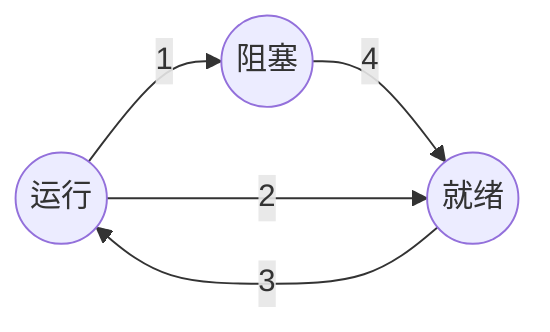

[toc]

# 版权声明

- 操作系统系列学习笔记来源 Andrew S. Tanenbaum 和 Herbert Bos 的著作《现代操作系统》第4版[1]；
- 该系列笔记不以盈利为目的，仅用于个人学习、课后复习及科学研究；
- 如有侵权，请与本人联系（hqpan@foxmail.com），经核实后即刻删除；
- 本文采用 [署名-非商业性使用-禁止演绎 4.0 国际 (CC BY-NC-ND 4.0)](https://creativecommons.org/licenses/by-nc-nd/4.0/deed.zh) 协议发布；

# 1. Overview

- 计算机的运行模式：
  - 内核态：操作系统运行在内核态，对所有硬件具有完全访问权；
  - 用户态：其它软件运行在用户态，仅使用机器指令中的一个子集；
    - shell：运行在用户态的最低层次；
- 缓存：
  - L1缓存：位于 CPU 中，将已解码的指令传递给 CPU 的执行引擎，无延时；
  - L2缓存：存放最近使用的若干内存字，延时1-2个时钟周期；
- shell：一种命令解释器，不属于操作系统的一部分；
- 操作系统中的抽象概念：
  - 进程、线程；
  - 地址空间；
  - 文件；
- 并行和并发：
  - 并行：
    - 在同一时刻运行多个指令；
    - 需要特定的硬件支持，E.g. 多核处理器；
  - 并发：
    - 在一段时间内运行多个程序；
    - 通过进程和线程对计算资源的时分复用实现；
- 陷入：在用户程序中使用系统调用；

# 2. 进程和线程

## 2.1 进程

- CPU 的每个核在同一时刻仅能运行1个进程；
- 1个程序运行2遍，则视为2个进程，E.g. 2次启动同一个字处理软件；
- 守护进程：在后台运行的特殊进程，用于执行特定的系统任务；
- 进程表：存放各个进程的相关信息；
- 进程控制块：PCB，Process Control Block，描述进程的基本信息和运行状态；
- 进程切换：亦称上下文切换；
- ==面试题== 进程的状态及转换方式：如下图所示；
  - 进程状态：
    - 运行态；
    - 就绪态：进程具备运行条件，等待系统分配计算资源；
    - 阻塞态：进程不具备运行条件，等待外部事件触发后才能执行，E.g. 等待用户输入数据后执行；
  - 转换方式：
    - 1：进程等待外部事件触发；
    - 2：调度系统选择另一进程；
    - 3：调度系统选择当前进程；
    - 4：外部事件触发，进程运行；

## 2.2 线程

- 每个线程由自己的堆栈；
- 实现线程包的方法：
  - 用户级线程：在用户空间中实现线程，内核不知道有线程存在，内核选择要执行的进程，进程决定要执行的某个线程；
  - 内核级线程：在内核空间中实现线程，内核直接决定要执行的线程；
- ==面试题== 内核态和用户态的区别？
  - 内核态：运行系统程序，权限较高；
  - 用户态：运行用户程序，权限较低；
  - 内核态和用户态之间的转换方式：
    - 系统调用；
    - 异常；
    - 中断；
- ==面试题== 进程和线程的区别：
  - 拥有资源：
    - 进程是资源分配的基本单位；
    - 线程是 CPU 调度的基本单位；
  - 创建和撤销：
    - 一个进程可包含多个线程，同一进程中的线程资源共享；
    - 线程的创建、撤销开销小于进程；
  - 通信：
    - 进程间通信需要借助 IPC；
    - 线程间可通过直接读写同一进程中的数据进行通信；

## 2.3 进程间通信

- IPC：Inter Process Communication，进程间通信；
- 竞争条件：多个进程读写某些共享数据时，其结果取决于进程运行的精确时序；
- 临界区：访问共享资源的程序片段；
- 忙等待和自旋锁：
  - 忙等待：连续检测某个变量，直至其等于某个特定值；
  - 自旋锁：用于忙等待的锁；
- 实现临界区互斥的方法：
  - 屏蔽中断；
  - 锁变量：使用布尔值，表示当前是否有进程位于临界区内；
  - 严格轮换法：使用一个变量，记录当前进入临界区的进程号；
  - Peterson 解法：一种互斥算法，参见 [1] Page 70；
  - TSL 指令：test and set lock，测试并加锁，基于硬件的解决方案，锁住总线；
- 生产者-消费者问题：根据缓冲区中的数据量与缓冲区容量的大小关系，协调生产者进程、消费者进程的状态；
  - 睡眠、唤醒；
  - 信号量；
- 管程：monitor，由过程、变量和数据结构组成的集合，；
  - 任意时刻下，管程中仅能有1个活跃进程；
- 饥饿：所有程序都在不停地运行，但均无法取得进展；
- ==面试题== 进程间通信方式：
  - 管道：一种半双工的通信方式，适用于父子、兄弟进程间通信；
  - 命名管道：一种半双工的通信方式，适用于任意进程间通信；
  - 信号量：不能传递复杂消息，作为进程间、同一进程的不同线程间同步方式，控制对共享资源的访问；
  - 消息队列：由消息组成的链表，支持全双工通信；
  - 共享内存：速度最快的进程间通信方式；
  - 套接字：Socket，可用于不同设备上的进程间通信；

## 2.4 调度

- ==面试题== 进程调度算法？
  - 批处理系统：
    - 先来先服务；
    - 最短作业优先；
    - 最短剩余时间优先；
  - 交互式系统：
    - 时间片轮转；
    - 优先级调度；
    - 多级队列：为低优先级的进程分配较多时间片，每当一个进程执行完毕后，降低该进程的优先级；

# 3. 内存管理

## 3.1 定义

- 存储管理器：操作系统中用于管理分层存储器体系的部分；
- BIOS：Basic Input Output System，基本输入输出系统，位于 ROM 中；

## 3.2 地址空间

- 地址空间：某个进程用于寻址的地址空间的集合；
  - 地址空间独立于其它进程的地址空间；
  - 在某些特殊情况下，进程共享地址空间；
- 处理内存超载的方法：
  - 交换技术：将空闲进程存回磁盘；
  - 虚拟内存；
- 内存紧缩：交换技术使得内存中产生多块不连续的空闲区域，可将多个进程在内存中占据的空间移动，使被占用的内存空间保持连续；

## 3.3 虚拟内存

- ==面试题== 为什么要虚拟内存？
  - 程序运行所需内存大于物理内存空间大小；
  - 虚拟内存：每个程序拥有各自的地址空间，该空间被分割为多页，将当前程序所需的页面映射到内存中，即可运行程序；
  - 允许在较小的物理内存上运行较大的程序；
- 页表：给出虚拟地址（程序地址空间）和物理内存地址之间的映射关系；
- 虚拟地址：页面号+偏移量；
- 页面和页框：
  - 页面：将**虚拟地址**空间按照固定大小划分为若干单元；
  - 页框：将**物理内存**空间按照固定大小划分为若干单元；
- 缺页中断/缺页错误：程序访问了一个未被映射到物理内存中的页面，需将该页调入内存；
- 处理较大的虚拟地址空间：
  - 多级页表；
  - 倒排页表；

## 3.4 页面置换算法

- 系统为每个页面设置状态位：
  - R 位：页面被访问，则该位为 1，否则为 0，R 位会被定时清零；
  - M 位：页面被修改，则该位为 1，否则为 0；
- ==面试题== 页面置换算法：若程序待访问的页面不在内存中，则发生缺页中断，将该页调入内存；页面置换算法使得页面置换频率最低；
  - 最优页面置换算法：
    - 置换内存中此后最长时间内不被访问的页面；
    - 仅为理论算法，无法实现，因为无法确定某个页面下次被访问的时间；
  - 最近未使用页面置换算法；NRU，Not Recently Used，淘汰一个未被访问的已修改页面；
    - 按状态位取值，将页面分为 4 类：
      - R = 0，M = 0；
      - R = 0，M = 1，已被修改的脏页面；
      - R = 1，M = 0，被频繁访问的干净页面；
      - R = 1，M = 1；
    - 从类编号最小的类中随机选中一个页面换出；
  - 先进先出页面置换算法：FIFO，First-In First-Out；
  - 第二次机会页面置换算法：避免 FIFO 中常用的页面被置换；
    - 若链表首部的页面 R 位为 0，则表明该页面为未被使用的旧页面，将其从链表中删除；
    - 若链表首部的页面 R 位为 1，则将其置 0，并将该页面添加至链表尾部；
  - 时钟页面置换算法：避免第二次机会页面置换算法中，在链表中频繁地移动页面；
    - 使用环形链表替换第二次机会页面置换算法中的单链表；
  - 最近最少使用页面置换算法：LRU，Least Recently Used，置换内存中未使用时间最长的页面；
  - 工作集页面置换算法：
    - 工作集：某个进程最近 k 次内存访问使用的页面集合；
    - 预先调页：在进程运行前，在内存中预先装入对应的工作集；
  - 工作集时钟页面置换算法；

## 3.5 分段

- 段：Segment；
  - 将程序和数据划分为逻辑上独立的地址空间，有助于共享和保护；
  - 编译器在编译过程中会建立若干个表，其大小动态变化，在一维地址空间中，表的大小增加可能引起碰撞，分段可简化对长度经常变化的数据结构的管理；
  - 每个段的地址空间独立，其大小动态变化；
- 寻址方式：段号+段内地址；
- 分段和分页结合：对每个段进行分页，使得其兼具分段和分页的优点；
  - 分段的优点：模块化、保护、共享；
  - 分页的优点：页面大小统一、只使用段的一部分时无需将其全部调入内存；
- ==面试题== 分页和分段对比：

|       差异       |              分页              |                           分段                           |
| :--------------: | :----------------------------: | :------------------------------------------------------: |
| 对开发者的透明性 |              透明              |                    需要开发者显式划分                    |
|   地址空间维度   |              一维              |                           二维                           |
|   大小是否可变   |            大小固定            |                       大小动态变化                       |
|       目的       | 实现虚拟内存，获得更大地址空间 | 将程序和数据划分为逻辑上独立的地址空间，有助于共享和保护 |

# 4. 文件系统

- 普通文件和目录：
  - 普通文件：包含用户信息的文件；
  - 目录：管理文件系统结构的系统文件；
  - 字符特殊文件：与输入输出相关，用于串行 I/O 类设备；
  - 块特殊文件：用于磁盘类设备；
- 文件访问方式：
  - 顺序访问；
  - 随机访问：能以任意顺序读取文件中的字节或记录；
- 路径表示方法：
  - 绝对路径：从根目录到目标文件的路径；
  - 相对路径：路径名相对于当前目录（亦称工作目录）；
    - `.`：指向当前目录，E.g. `./README.md`；
    - `..`：指向当前目录的父目录，若当前目录为根目录，则仍指向当前目录，E.g. `../lib`；
- 磁盘被划分为一个或多个分区，每个分区含有一个独立的文件系统；

# 5. 输入输出

- I/O 设备：
  - 块设备：将信息存储在固定的块中，以块为单位传输数据，每个块有独立的地址，均可独立读写；
  - 字符设备：以字符为单位传输数据；不可寻址；
- 磁盘结构：
  - 盘面：一个磁盘可含有多个盘面；
  - 磁道：一个盘面可含有多个磁道；
  - 扇区：磁道上的一段弧形区域，一个磁道可含有多个扇区；
  - 柱面：位于同一柱状垂直区域内的磁道；
- 影响磁盘读写速度的要素：
  - 寻道时间：将磁盘臂移动到目标柱面所需时间；
    - 寻道时间是影响磁盘读写速度的主要原因；
    - 因此磁盘调度算法的目标是缩短寻道时间；
  - 旋转延迟：等待目标扇区旋转至磁头下方；
  - 实际数据传输时间；
- 磁盘调度算法：
  - 先来先服务：按照磁盘驱动程序接收请求的顺序完成请求；
    - 缺点：无法优化寻道时间；
  - 最短寻道优先磁盘调度算法：优先处理距离当前磁头最近的磁道请求；
    - 缺点：该算法公平性欠佳，若多个相邻磁道上的请求较为密集，则远离该区域的磁道上的请求将长时间得不到响应；
  - 电梯算法：沿某个方向响应磁道请求，直至该方向上没有请求，此时改变方向，重复上述步骤；
    - 由于更换了移动方向，因此所有请求都将得到满足，公平性更好；

# 6. 死锁

## 6.1 死锁简介

- 资源：
  - 可抢占资源：从拥有该资源的进程中抢占该资源，无任何副作用；
  - 不可抢占资源：若从拥有该资源的进程中抢占该资源，将使得计算失败；
- 资源所需的时间顺序：
  - 请求资源：若请求资源失败，则该进程被阻塞，“请求资源-休眠-再次请求资源 ……”；
  - 使用资源；
  - 释放资源；
- ==面试题== 资源死锁的4个必要条件：进程获取对资源的排他性访问权时，可能会出现死锁；
  - 互斥条件：每个资源或是可用的，或是已经分配给另一个进程；
  - 占有和等待条件：已得到某个资源的进程可请求新的资源；
  - 不可抢占条件：已分配给某个进程的资源不能被强制抢占，只能被占有该资源的进程主动释放；
  - 环路等待条件：两个或两个以上的进程组成的环路，环路中的每个进程都在等待下一个进程释放占有的资源；
- ==面试题== 处理死锁的方法：
  - 忽略死锁：鸵鸟算法；
  - 死锁检测和死锁恢复；
  - 死锁避免：谨慎分配资源，动态地避免死锁；
  - 死锁预防：破坏引起死锁的4个必要条件，预防死锁发生；

## 6.2 忽略死锁

- 忽略死锁：
  - 处理死锁代价较高；
  - 使用鸵鸟策略忽略死锁可获得更好的性能；

## 6.3 死锁检测和死锁恢复

- 死锁检测和死锁恢复：
  - 允许死锁发生；
  - 若检测到死锁已发生，则采取措施解决问题；
- 死锁检测方法：
  - 每种类型资源仅有一个的死锁检测：
    - 构建资源分配图：
      - 圆形表示进程，矩形表示资源；
      - 进程至资源的有向边：进程请求资源；
      - 资源至进程的有向边：资源占有进程；
    - 使用 DFS 检测有向图中是否存在环，若有环存在，则表示存在死锁；
  - 每种类型资源不止一个的死锁检测；
- 死锁恢复方法：
  - 利用抢占恢复：将某个死锁进程占有的资源转移给另一个死锁进程；
  - 利用回滚恢复：
    - 周期性的对进程进行检查点检查，即将进程的状态备份，其中包括存储映像和资源状态；
    - 若检测到死锁，即可得知死锁进程及其所需资源；
    - 将进程回滚至较早时刻，将资源分配给某个死锁进程；
  - 通过杀死进程恢复；

## 6.4 死锁避免

- 安全状态和不安全状态：
  - 安全状态：若当前状态为安全状态，则从该状态出发，存在某种调度方式，在不发生死锁的情况下，确保所有进程运行完毕；
  - 不安全状态：不一定会发生死锁，所有进程仍**可能**运行完毕，但系统不保证能得到该结果；
- 单个资源的银行家算法；
- 多个资源的银行家算法；

## 6.5 死锁预防

- 死锁预防方法：破坏引起死锁的4个必要条件，预防死锁发生；

|        条件        |       处理方式       |
| :----------------: | :------------------: |
|    破坏互斥条件    | 一切都使用假脱机技术 |
| 破坏占有和等待条件 | 在开始就请求全部资源 |
|  破坏不可抢占条件  |       抢占资源       |
|  破坏环路等待条件  |    对资源按序编号    |

# References

[1] Andrew S. Tanenbaum, Herbert Bos. 现代操作系统: 4版[M]. 北京: 机械工业出版社, 2017.