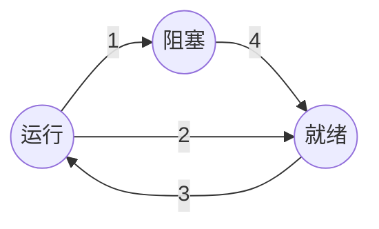

[toc]

# 版权声明

- 设计模式系列学习笔记来源 Andrew S. Tanenbaum 和 Herbert Bos 的著作《现代操作系统》第4版[1]；
- 该系列笔记不以盈利为目的，仅用于个人学习、课后复习及科学研究；
- 如有侵权，请与本人联系（hqpan@foxmail.com），经核实后即刻删除；
- 本文采用 [署名-非商业性使用-禁止演绎 4.0 国际 (CC BY-NC-ND 4.0)](https://creativecommons.org/licenses/by-nc-nd/4.0/deed.zh) 协议发布；

# 1. Overview

- 计算机的运行模式：
  - 内核态：操作系统运行在内核态，对所有硬件具有完全访问权；
  - 用户态：其它软件运行在用户态，仅使用机器指令中的一个子集；
    - shell：运行在用户态的最低层次；
- 缓存：
  - L1缓存：位于 CPU 中，将已解码的指令传递给 CPU 的执行引擎，无延时；
  - L2缓存：存放最近使用的若干内存字，延时1-2个时钟周期；
- shell：一种命令解释器，不属于操作系统的一部分；

# 2. 进程和线程

## 2.1 进程

- CPU 的每个核在同一时刻仅能运行1个进程；
- 1个程序运行2遍，则视为2个进程，E.g. 2次启动同一个字处理软件；
- 守护进程：在后台运行的特殊进程，用于执行特定的系统任务；
- 进程表：存放各个进程的相关信息；
- ==面试题== 进程的状态及转换方式：如下图所示；
  - 进程状态：
    - 运行态；
    - 就绪态：进程具备运行条件，等待系统分配计算资源；
    - 阻塞态：进程不具备运行条件，等待外部事件触发后才能执行，E.g. 等待用户输入数据后执行；
  - 转换方式：
    - 1：进程等待外部事件触发；
    - 2：调度系统选择另一进程；
    - 3：调度系统选择当前进程；
    - 4：外部事件触发，进程运行；

## 2.2 线程

- 每个线程由自己的堆栈；
- 实现线程包的方法：
  - 在用户空间中实现线程；
  - 在内核空间中实现线程；
- ==面试题== 进程和线程的区别：
  - 拥有资源：
    - 进程是资源分配的基本单位；
    - 线程是 CPU 调度的基本单位；
  - 一个进程可包含多个线程，同一进程中的线程资源共享；
  - 线程的创建、撤销开销小于进程；
  - 通信：
    - 线程间可通过直接读写同一进程中的数据进行通信
    - 进程间通信需要借助 IPC；

## 2.3 进程间通信

- IPC：Inter Process Communication，进程间通信；
- 竞争条件：多个进程读写某些共享数据时，其结果取决于进程运行的精确时序；
- 临界区：访问共享资源的程序片段；
- 忙等待和自旋锁：
  - 忙等待：连续检测某个变量，直至其等于某个特定值；
  - 自旋锁：用于忙等待的锁；
- 实现临界区互斥的方法：
  - 屏蔽中断；
  - 锁变量：使用布尔值，表示当前是否有进程位于临界区内；
  - 严格轮换法：使用一个变量，记录当前进入临界区的进程号；
  - Peterson 解法：一种互斥算法，参见 [1] Page 70；
  - TSL 指令：test and set lock，测试并加锁，基于硬件的解决方案，锁住总线；
- 生产者-消费者问题：根据缓冲区中的数据量与缓冲区容量的大小关系，协调生产者进程、消费者进程的状态；
  - 睡眠、唤醒；
  - 信号量；
- 管程：monitor，由过程、变量和数据结构组成的集合，；
  - 任意时刻下，管程中仅能有1个活跃进程；

## 2.4 调度

- 

# ==Schedule==

- 总页数：263-48=215 页;
- 对照面经，每天整理几个面试题；
- 学习进度：每天15页，自5月23日起，6月6日完成；
- 当前进度：Page 88，2.4.1 已完成；

# References

[1] Andrew S. Tanenbaum, Herbert Bos. 现代操作系统: 4版[M]. 北京: 机械工业出版社, 2017.